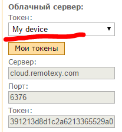
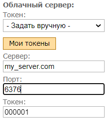

# Облачный сервер

Облачный сервер RemoteXY позволяет вам подключаться к вашему устройству из любой точки мира где есть интернет. 

При использовании облачного сервера вам не нужен белый IP адрес и настройка портов вашего роутера. Облачный сервер находится в открытом доступе в сети интернет, всегда доступен как для вашего устройства так и для вашего телефона. Эта особенность позволяет соединять ваш телефон и ваше устройство очень просто.

Сервер RemoteXY не хранит какие либо данные получаемые с контроллера или с телефона. Сервер не хранит исторические данные. Сервер осуществляет только функцию транспорта данных между телефоном и контроллером в режиме реального времени.

В своих проектах вы можете использовать публичный облачный облачный сервер или развернуть свой собственный облачный сервер. 

### Публичный облачный сервер

При использовании публичного облачного сервера вы создаете токен для устройства в личном кабинете на нашем сайте. Далее вы выбираете этот токен в настройках подключения редактора. Все настройки осуществляются автоматически. 

- адрес публичного сервера: cloud.remotexy.com
- порт для подключения контроллера: 6376
- порт для подключения приложения: 6375

### Собственный облачный сервер

Если вы разрабатываете коммерческий проект, если вам необходима большая приватность и независимость, вы можете развернуть свой собственный сервер RemoteXY следуя инструкции ниже.

Собственный облачный сервер RemoteXY будет удобен в следующих случаях:

- Вы разрабатываете коммерческий проект где все ваши устройства могут обслуживаться вашим облачным сервером;
- Вы хотите обеспечить большую приватность ваших данных;
- Вы хотите обеспечить большую независимость от различных блокировок трафика через границы некоторых стран.

Что бы развернуть собственный сервер RemoteXY следуйте [инструкции](https://remotexy.com/en/help/cloud/mycloud/).

Для настройки подключения контроллера к вашему собственному серверу, в редакторе в разделе настроек подключения в поле токен необходимо выбрать пункт **Задать вручную**. Далее вы должны указать URL или IP адрес вашего сервера, порт для контроллера и токен устройства. 

Порты для контроллера и для телефона вы определяете при установке и настройке сервера. Токены для устройства вы сможете регистрировать самостоятельно используя админ панель вашего облачного сервера.

