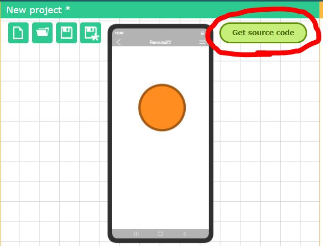
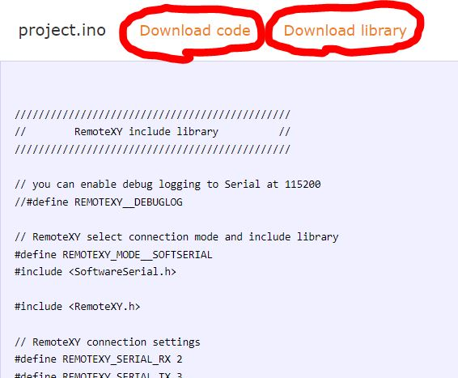

# How to get the source code

Click the green **Get source code** button located at the top right of the editor area to get the source code of the grathical interface. The automatically generated source code will be displayed on the open page.

At the top of the page you can see a list of steps that need to be completed to be able to use the grathical interface. The source code will be posted below.

The source code is generated for the IDE that was selected in the project configuration settings.  Different source code will be generated for different boards, IDE, and different communication modules. You need to download it or copy it.

To compile the source code you will need the RemoteXY library. Follow the link [Download library](https://remotexy.com/en/library/). Follow the guides on the library download page to install it in your IDE.

Before you start modifying the source code, try compiling it and loading it into the board. The source code should compile without errors.  Connect to your board using the [RemoteXY application](https://remotexy.com/en/download/) and check that your GUI opens and works.

Once you are sure that the interface works, you can modify the source code to change it to suit your needs.