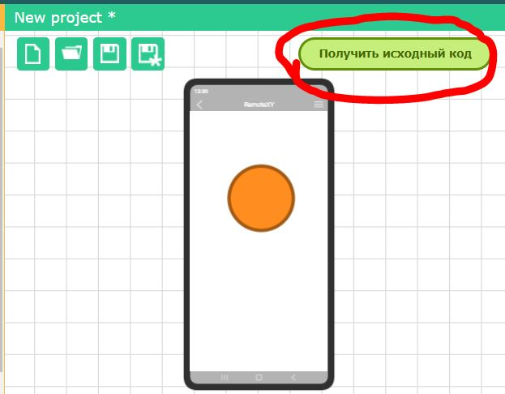
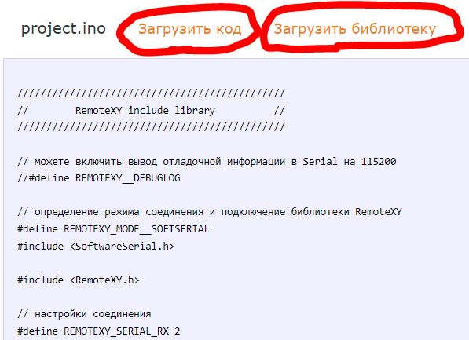

# Как получить исходный код

Для того что бы получить исходный код интерфейса, нажмите зеленую кнопку **Получить исходный код**, которая расположена сверху справа области редактора. Вы будете перенаправлены на страницу сайта, где отобразится сформированный исходный код.

Вверху открывшейся страницы вы увидите список шагов что необходимо сделать что бы вы могли использовать графический интерфейс. Ниже будет размещен исходный код.

Исходный код формируется для среды разработки, которая была выбрана в настройках конфигурации проекта. Для разных микроконтроллеров, сред разработки, разных модулей связи будет сформирован разный исходный код. Вам необходимо загрузить его или скопировать. 

Для компиляции исходного кода потребуется библиотека RemoteXY. Пройдите по ссылке [Загрузить библиотеку](https://remotexy.com/ru/library/). Следуя инструкции на странице загрузки библиотеки установите ее в вашу среду разработки.

Перед тем как начать дополнять или изменять исходный код, попробуйте скомпилировать его и загрузить в контроллер. Исходный код должен компилироваться без ошибок.  Подключитесь к вашему контроллеру используя [приложение RemoteXY](https://remotexy.com/ru/download/) и проверьте что ваш графический интерфейс открывается и работает.

После того как вы проверили что интерфейс работает, вы можете приступить к дополнению исходного кода что бы адаптировать его для вашей задачи. 

