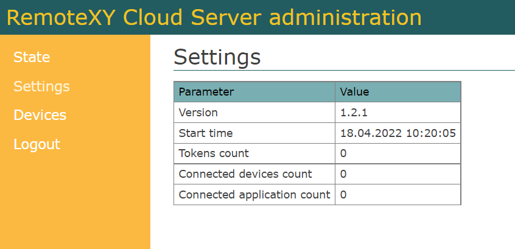
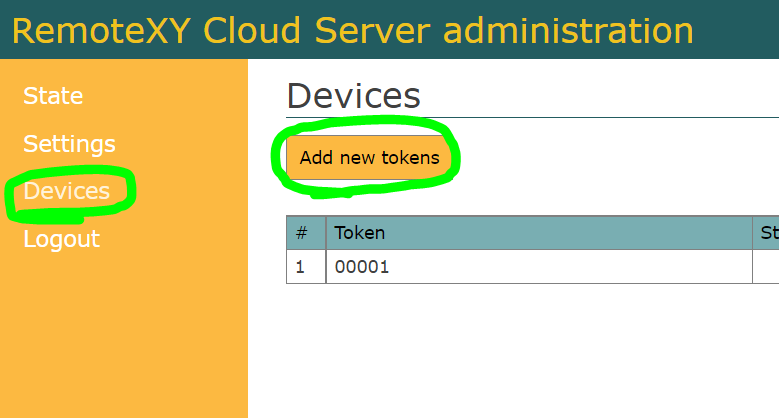
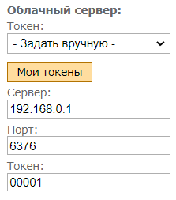
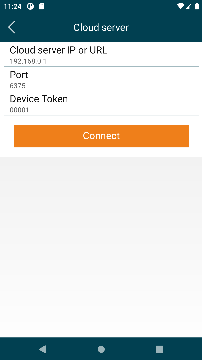

# Собственный облачный сервер

Вы можете продолжать использовать публичный облачный сервер RemoteXY. Но возможно вам будет интересно иметь свой собственный сервер RemoteXY, который вы можете развернуть следуя инструкции ниже.

Собственный облачный сервер RemoteXY будет удобен в следующих случаях:

- Вы разрабатываете коммерческий проект где все ваши устройства могут обслуживаться вашим облачным сервером;
- Вы хотите обеспечить большую приватность ваших данных;
- Вы хотите обеспечить большую независимость от различных блокировок трафика через границы некоторых стран.

Мы предлагаем развернуть облачный сервер с использованием Docker контейнера. Ссылка на контейнер в хранилище:

[https://hub.docker.com/r/remotexy/cloud](https://hub.docker.com/r/remotexy/cloud)

## Шаг 1. Выбор оборудования для размещения

Вы можете использовать следующие оборудование для размещения сервера:

- Аренда виртуального выделенного сервера VPS/VDS;
- Компьютер с белым IP адресом;
- Компьютер в локальной сети если вам нужен доступ только внутри вашей сети;
- Локальный компьютер для экспериментов.

Вы можете использовать любую операционную систему которая поддерживается Docker. Используйте инструкцию Docker по разворачиванию контейнеров на вашем оборудовании.

### Сервер VPS

Хорошим решением будет использовать виртуальный сервер VPS.

Выберите поставщика виртуальных серверов VPS и арендуйте сервер. Выбирайте физическое размещение сервера в стране где вы планируете использовать ваше устройство к которому вы хотите подключаться. Вам подойдет сервер с самыми скромными характеристиками. Выберите сервер с установленной операционной системой Ubuntu, без каких либо дополнений.

Поставщик должен присвоить вашему новому серверу IP адрес , это так же будет адресом облачного сервера RemoteXY. Для примеры пусть это будет адрес 192.168.0.1.

Так же у вас должны быть логин и пароль для подключения к серверу через терминал что бы вы могли произвести установку движка Docker и запустить контейнер.

## Шаг 2. Установка Docker

Следуйте инструкции по установке Docker Engine на ваш сервер/компьютер с [официального сайта](https://docs.docker.com/engine/install/). Инструкцию по установке на Ubuntu можете найти по [этой ссылке](https://docs.docker.com/engine/install/ubuntu/).

## Шаг 3. Запуск контейнера remotexy/cloud

Запустите контейнер remotexy/cloud следующей командой:

`docker run -d -p 6380:6380 -p 6376:6376 -p 6375:6375 --restart=always -t remotexy/cloud`

## Шаг 4. Настройка сервера RemoteXY

Используя любой браузер введите в URL адрес страницы, который состоит из IP адреса вашего сервера и номера порта `http://192.168.0.1:6380`. Выполните вход в админ-панель сервера используя следующие данные по умолчанию для входа:

- **User**: remotexy
- **Password**: remotexy

После успешного входа вы увидите страницу статистики.

Перейдите на вкладку **Settings**. Измените логин и пароль для доступа к админ-панели.

Если вы измените номера портов, вам будет необходимо перезапустить контейнер Docker и указать в параметре -p номера новых портов. Подробнее смотрите документацию запуска контейнера Docker.

Перейдите на вкладку **Devices**. Нажмите кнопку **Add new tocken** и введите строку токена вашего устройства. Это может быть любая строка из латинских букв и цифр длиной до 32 символов. Вы можете добавить неограниченное количество токенов.

## Шаг 5. Настройка контроллера

В исходном коде для контроллера должны быть указаны параметры для подключения к вашему облачному серверу. Это можно сделать через редактор интерфейсов или непосредственно в исходном коде программы.

В редакторе интерфейсов на правой панели управления в разделе **Подключение модуля** укажите данные вашего облачного сервера. В поле **Токен** выберите настройку **Задать вручную**. Укажите IP адрес вашего сервера, порт для подключения устройства и токен, который вы завели на предыдущем шаге.

## Шаг 6. Подключение из приложения

Запустите приложение для телефона и нажмите кнопку **+** (Плюс) на верхней панели справа и выберите подключение **Облачный сервер**. В открывшемся окне введите IP адрес вашего сервера, порт для подключения с мобильного приложения и токен который вы ввели в админ-панели сервера. Нажмите кнопку **Подключиться**. 

