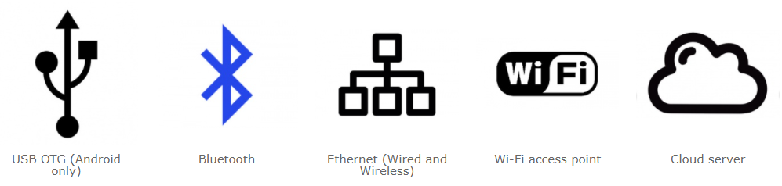

# Connection options

Connection option determines how your board will communicate with the phone. The connection option is selected when configuring the hardware on the **Configuration** tab on the right toolbar.

## USB OTG

The board connects to the phone via a USB cable. The chip of board must have a UART port with a connected USB-UART converter or built-in USB support. The phone must support USB OTG mode. 

An important feature of the communication method is the transmission of data over wires, the absence of the influence of radio interference on the quality of communication, the ability to power the board from the phone. Fits:

- For measuring devices. The device can be connected to the phone via a USB cable when it is needed. Get power from your phone and display measurement results using a graphical interface.
- As a replacement for the integrated display. The phone connects to your device by wire and acts as a human-machine interface to control this device.

## Bluetooth

The board must have integrated Bluetooth support or an external Bluetooth module. The phone connects to the board via Bluetooth and must support this communication.

The connection option is convenient for connecting to nearby devices. Data is transmitted as quickly as possible and often enough to control sensitive and fast devices. Fits:

- To control objects with visual control: a robot, a car, a quadcopter.
- To control smart home systems while inside the house.
- To control devices and systems where there is enough control in the visibility zone.

## WiFi access point

The board must have integrated WiFi support or an external WiFi module that is capable of opening an access point. The phone will connect to the board access point using WiFI.

The connection option is convenient for connecting to nearby devices. Data transfer is somewhat slower than via Bluetooth. Fits:

- To control smart home systems while inside the house.
- To control devices and systems where Internet remote control is not required.

> Note. When the phone connects to the device's WiFi access point, it disconnects from your main home access point. If the main access point gave you access to the Internet, you will not be able to use the Internet while you are connected to the device. Alternatively, you can use the Internet through the mobile data.

## Ethernet

The board must be able to connect to the network. Network connection can be either via ethernet cable or via WiFi. The board must have integrated support for this communication method or an external Ethernet or WiFi communication module. Communication will be available only within the local network. Communication will be available only within the local network. To connect from anywhere in the world, you need a static IP address of Internet, as well as setting up a router to forward the port to your board.

> Note. To obtain a static IP address, you need to contact your Internet provider.

When connecting to the board from a phone, you must enter the IP address that the controller received on your network. You can find out this IP address through the admin panel of the router. It will be better if you configure the router in such a way that the board always receives the same fixed IP address. If you configured a static IP address of Internet and port forwarding, then you need to enter this IP address.

The connection option is convenient for devices located in the local network that do not require connection from anywhere in the world.

## Cloud

The board must be able to connect to the Internet. Network connection can be either via Ethernet cable or via WiFi. Your network must be connected to the Internet. The board must have integrated support or an external Ethernet or WiFi communication module.

This connection options allows you to connect to the controller from anywhere in the world without any additional settings for your network. The cloud server acts as an intermediary. Both the board and the phone can connect to the cloud server, and this makes it easy to connect the phone to the board. **Token** is used to identify the controller and phone on the cloud server. The token is stored on the controller and entered on the phone upon connection.

> Note. The RemoteXY cloud server does not store any data from the controller and does not accumulate archives when the phone is not connected to the board.

You can use the RemoteXY public cloud server and can deploy your own cloud server.

When connecting to the board from your phone, you must enter the cloud server address and the token. The phone must be able to access the Internet in any way.

The connection option is convenient for devices requiring connection from anywhere in the world. However, this communication method has the highest data delivery time. Probably not convenient for devices requiring fast operational control, such as quadcopters and moving cars and robots.

