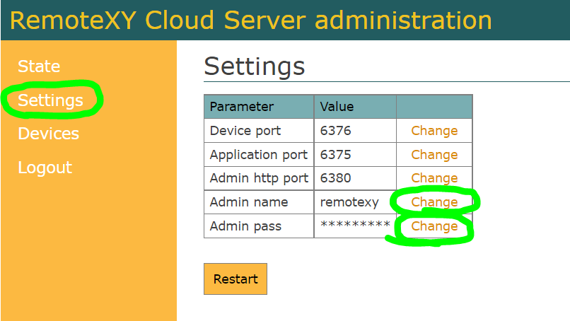
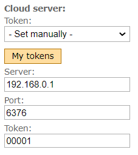

# Own Cloud server

You can continue to use the public RemoteXY cloud server. But you might be interested in having your own RemoteXY server, which you can deploy following the instructions below.

Your own cloud server RemoteXY will be convenient in the following cases:

- You are developing a commercial project where all your devices can be served by your cloud server;
- You want to ensure greater privacy of your data;
- You want to provide greater independence from various traffic blocking across the borders of some countries.

We propose to deploy a cloud server using a Docker container. Link to the container in the repository:

[https://hub.docker.com/r/remotexy/cloud](https://hub.docker.com/r/remotexy/cloud)

## Step 1. Choose a hardware to host

You can use the following hardware to host the server:

- Rent virtual dedicated VPS/VDS servers;
- Computer with a white IP address;
- A computer on a local network if you need access only within your network;
- Local computer for experiments.

You can use any operating system supported by Docker. Use the Docker guide for deploying containers on your hardware.

### VPS server

A good solution would be to use a virtual dedicated VPS server.

Choose a provider of virtual VPS servers and rent a server. Choose the physical location of the server in the country where you plan to use your device to which you want to connect. A server with the most modest characteristics will suit you. Choose a server with Ubuntu operating system installed, without any add-ons.

The provider must assign an IP address to your new server, this will also be the address of the RemoteXY cloud server. For examples, let this be the address 192.168.0.1.

You must also have a username and password to connect to the server via the SSL terminal so that you can install the Docker Engine and run the container.

## Step 2. Install Docker

Follow the guide to install Docker Engine on your server/computer from [official site](https://docs.docker.com/engine/install/). You can find the installation guide for Ubuntu at [this link](https://docs.docker.com/engine/install/ubuntu/).

## Step 3. Run a container remotexy/cloud

Run the remotexy/cloud container with the following command:

`docker run -d -p 6380:6380 -p 6376:6376 -p 6375:6375 --restart=always -t remotexy/cloud`

## Step 4. Configure the RemoteXY Server

Using any browser, enter in the URL the address of the page, which consists of the IP address of your server and the port number `http://192.168.0.1:6380` . Log in to the server admin panel using the following default login details:

- **User**: remotexy
- **Password**: remotexy

After a successful login, you will see the statistics page.

Go to the **Settings** tab. Change your login and password to access the admin panel.

If you change the port numbers, you will need to restart the Docker container and specify the new port numbers in the `-p` option. See the documentation for running a Docker container for details.

Go to the **Devices** tab. Click the **Add new token** button and enter your device token string. It can be any string of Latin letters and numbers up to 32 characters long. You can add an unlimited number of tokens.

## Step 5. Board settings

The source code for the board must contain parameters for connecting to your cloud server. This can be done through the interface Editor or directly in the source code of cketch.

In the interface Editor on the right toolbar, in the **Module interface** setting, specify the data of your cloud server. Select the **Set manually **in the **Token** field. Specify the IP address of your server, the port for connecting the board and the token that you entered in the previous step.

## Step 6. Connect from the app

Launch the phone app and click the **+** (Plus) button on the top bar on the right and select the **Cloud Server** connection. In the window that opens, enter the IP address of your server, the port for connecting from the mobile application and the token that you entered in the server admin panel. Click the **Connect** button.

