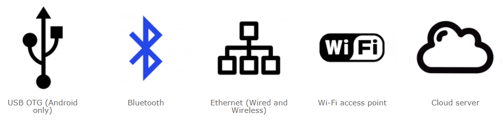

# Варианты связи с контроллером

Способ связи определяет как ваш контроллер будет связываться с телефоном. Способ связи выбирается при настройке конфигурации оборудования на вкладке **Конфигурация** правой панели инструментов.

## USB OTG

Контроллер подключается к телефону через USB кабель. Контроллер должен иметь UART порт с подключенным USB-UART конвертером или встроенную поддержку USB. Телефон должен поддерживать режим работы USB OTG. 

Отличительной особенностью способа связи является передача данных по проводам, отсутствие влияния радиопомех на качество связи, возможность питания контроллера от телефона. Подходит:

- Для измерительных приборов. Прибор может подключаться к телефону через USB кабель когда в нем есть необходимость. Получать питание от телефона и отображать результаты измерения используя графический интерфейс.
- В качестве замены интегрированного дисплея. Телефон подключается к вашему оборудованию по проводу и выполняет функции человеко-машинного интерфейса для управления этим оборудованием.

## Bluetooth

Контроллер должен иметь интегрированную поддержку Bluetooth или внешний модуль Bluetooth. Телефон подключается к контроллеру по Bluetooth и должен поддерживать этот способ связи.

Способ связи удобен для подключения к близко расположенным устройствам. Данные передаются максимально быстро и достаточно часто что бы управлять чувствительными и быстрыми устройствами. Подходит:

- Для управления объектами с визуальным контролем: роботом, машинкой, квадрокоптером.
- Для управления системами умного дома при нахождении внутри дома.
- Для управления оборудованием и системами где не требуется удаленный контроль.

## WiFi точка доступа

Контроллер должен иметь интегрированную поддержку WiFi или внешний модуль WiFi который способен поднимать точку доступа. Телефон будет подключаться к точке доступа контроллера используя WiFI.

Способ связи удобен для подключения к близко расположенным устройствам. Данные передаются несколько медленнее чем через Bluetooth. Подходит:

- Для управления системами умного дома при нахождении внутри дома.
- Для управления оборудованием и системами где не требуется дистанционный контроль.

> Примечание. Когда телефон подключается к WiFi точке доступа устройства, он отключается от вашей основной точки доступа. Если основная точка доступа давала вам выход в интернет, вы не сможете использовать интернет пока вы связаны с устройством. Как вариант вы сможете использовать интернет через мобильные данные сотового оператора.

## Ethernet

Контроллер должен иметь возможность подключения к сети. Подключение к сети может быть как по кабелю так и через WiFi. Контроллер должен иметь интегрированную поддержку данного способа связи или внешний модуль связи Ethernet или WiFi. Связь будет осуществляться только внутри локальной сети. Для подключения из любой точки мира необходим статический IP адрес в сети Интернет, а так же  настройка роутера для проброса порта к вашему контроллеру. 

> Примечание. Для получения статического IP адреса вам необходимо обратиться к вашему провайдеру интернета.
>

При подключении к контроллеру с телефона вы должны указать IP адрес который контроллер получил в вашей сети. Узнать этот адрес можно через админпанель роутера. Будет лучше если вы настроите роутер таким образом, что бы контроллер получал всегда один и тот же фиксированный IP адрес. Если вы настроили статический IP адрес и проброс порта, тогда вам необходимо указать этот IP адрес.

Способ связи подходит для устройств размещенных в локальной сети, не требующих подключения из любой точки мира.

## Облако

Контроллер должен иметь возможность подключения к сети интернет. Подключение к сети может быть как по кабелю так и через WiFi. Ваша сеть должна иметь выход в Интернет. Контроллер должен иметь интегрированную поддержку или внешний модуль связи Ethernet или WiFi. 

Данный способ связи позволяет подключиться к контроллеру из любой точки мира без каких либо дополнительных настроек вашей сети. Облачный сервер выступает в качестве посредника. К облачному серверу может подключиться как контроллер так и телефон, и это дает возможность легко соединить телефон с контроллером. Для идентификации контроллера и телефона на облачном сервере используется **Токен**. Токен хранится на контроллере и вводится на телефоне при подключении.

> Примечание. Облачный сервер RemoteXY не является хранилищем каких либо данных из контроллера и не накапливает архивы когда телефон не подключен к контроллеру.

Вы можете использовать как публичный облачный сервер RemoteXY, так и развернуть свой собственный облачный сервер.

При подключении к контроллеру с телефона вы должны указать адрес облачного сервера в сети интернет и токен контроллера. Телефон должен иметь доступ в Интернет любым способом.

Способ связи подходит для устройств требующих подключения из любой точки мира. Однако данный способ связи имеет самое высокое время доставки данных. Скорее всего не подходит для устройств требующих быстрого оперативного контроля, таких как квадрокоптеры и движущиеся роботы.
