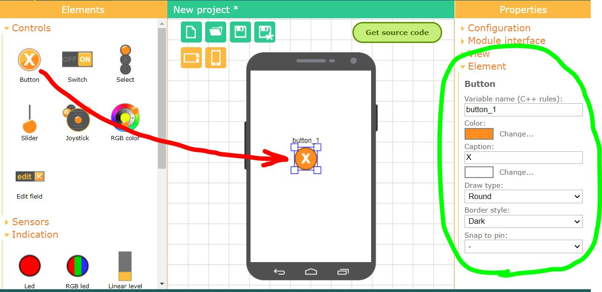
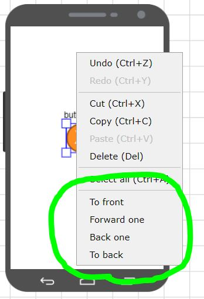

# Elements of graphical interface

Use the phone field to place elements. Select the required element in the left toolbar and drag it to the phone field using the left mouse button.  Once you have placed the element in the phone field, you can move it to the desired position and resize it. Use the square areas at the corners of the selection to resize. You can change the properties of the selected element by opening the **Element** tab in the right toolbar.

All elements are divided into four groups. Groups combine elements according to some common properties.

- **Controls**. Using these elements, you can send the control actions. Information about the state of the element is sent from the phone to the board.
- **Sensors**. Using these elements, you can transfer data from your phone's sensors to the board.
- **Indication**. Using these elements, any information and data sent from the controller to the phone can be displayed.
- **Decoration**. These elements do not transmit any data, they are necessary to make your interface more beautiful and usability.

Later, when you get the source code for the board, for all elements the variables in the `RemoteXY` structure will be created, and you can easily use them in your program.

## Element position and size

Each placed element can be moved to any place on the phone screen and resize it. You can also change the properties of the element.

To move an element, select it and move it with the left mouse button.

To change the size of an element, select it, then use the square zones at the corners of the selection area with the left mouse button to resize the element.

## Element properties

To change properties, an element must be selected, then in the right toolbar open the **Element** tab and you will see what properties of the element can be changed. Each element has different properties. Most of the elements have the same properties, such as element name and color.

## Element name

An important property of an element is its name. The name must be unique for each element.The element name will be used to construct the name of variables in the `RemoteXY` structure in the source code. Therefore, the name of the variable must be specified according to the rules of C++. The name must not contain spaces, contain only letters, digits and underscores. The name cannot start with a digit.

## Display levels

All elements are drawn on the screen in strict order one after another. This allows you to place some elements on top of others. For example, you can set the **Panel** element as the background for another element. To do this, place the **Panel** element under this element.

You can move items across display levels. To do this, click right mouse button on the selected item, then select from the context menu:

- **To front**. The element will be drawn last and will cover all previously drawn elements.
- **Forward one**. The item will go up one level.
- **Back one**. The element will go down one level.
- **To back**. The element will be drawn very first and all other elements will be drawn on top of it.

## Copy and delete

You can copy the element and then paste it with all the configured properties. 

To copy, select an element, click right mouse button on the selected element, then select **Copy** from the context menu. Or press Ctrl+C. To copy the item and delete it, select **Cut**, or press Ctrl+X.

To insert an element, you need to unselect all the elements, in the place where you want to insert, click right mouse button, select **Paste** in the context menu. Or press Ctrl+V. If you activate the paste function on the selected element, then the selected elements will be replaced with the copied one. The selected elements will be deleted, and the copied element will be inserted in their place.

To delete an element, click right mouse button on the selected element, then select **Delete** from the context menu. Or press Del. 

