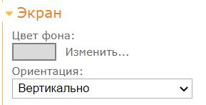
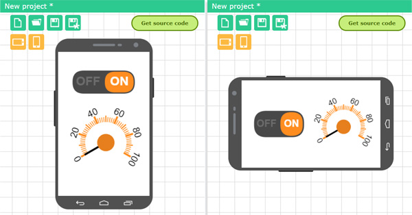

# Настройки экрана

Настройка параметров экрана осуществляется на вкладке **Экран** правой панели управления. Можно установить цвет фона и ориентацию экрана.

Ориентация экрана может быть следующей:

- Вертикальная. При отображении интерфейса он всегда будет в вертикальном положении, даже если вы будете вращать телефон.
- Горизонтальная. При отображении интерфейса он всегда будет в горизонтальном положении, даже если вы будете вращать телефон.
- Оба варианта. При вращении телефона интерфейс будет так же поворачиваться в вертикальную или горизонтальную версию.

### Особенности разработки для двух ориентаций

Если вы выбрали ориентацию интерфейса в обеих вариантах, вам необходимо разместить все элементы управления в двух вариантах: вертикальной и горизонтальной. Рядом с полем телефона отобразятся кнопки выбора текущей ориентации. Нажимая на эти кнопки вы сможете переключаться между ориентациями. 

Вам не нужно для каждой ориентации устанавливать отдельные элементы. Любой установленный элемент будет сразу отображаться на двух ориентациях. Все свойства элементов будут так же одни и те же, так как по сути это один и тот же элемент. Вы можете изменить только размер элемента и его положение на экране.

