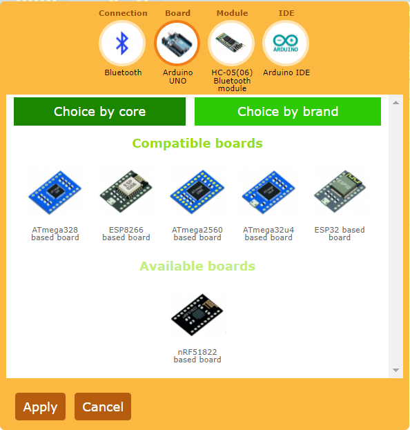

# Hardware configuration

You need to set up your hardware configuration and the communication method between the phone and the board. You will generate the interface source code using the capabilities of your hardware. Configuration is performed on the **Configuration** and **Module interface** tabs on the right toolbar.

## Configuration

Open the **Configuration** tab on the right toolbar and click on any item in the list.  The hardware configuration selection window will open. You need to set four parameters that define your hardware.

- **Connection**. Specifies how your controller will connect to the phone. 
- **Board**. Specifies which board you are using.
- **Module**. Specifies which communication module you are using.
- **IDE**. Specifies for which IDE you want to get the source code.

To select each parameter, click in the circle of this parameter at the top of the window, then select the required element in the list below.

All parameters are interrelated, and some are incompatible. As you select each parameter, you will see that the list of items to select is divided into compatible and incompatible (marked as available). The compatible list will contain those elements that are compatible with the other parameters already selected. Incompatible, or available, will include elements that do not fit the already selected parameters. For example, if you choose the WiFi connection method, then all communication modules that do not have WiFi will fall into incompatible.

You can select any element, both compatible and incompatible. But when an incompatible element is selected, all other parameters with which this element is not compatible will be reset. It need to be reselected.

Thus, the editor monitors that the correct hardware configuration that is supported by the editor is selected. If you do not select any parameter, you will not be able to apply the selected settings.

### Connection

To select a connection method, click on the **Connection** icon at the top of the window. 

For more information about the types of connections, see the section [Connection options](https://remotexy.com/en/help/connections/)

### Board

To select a board, click on the **Controller** icon at the top of the window.

You can choose a controller based on the chip on which it is built. To do this, press the filter button **Select by core**. You can also choose a controller of a specific brand and a specific model, for this, click the filter button **Select by brand**. 

### Module

To select a communication module, click on the **Module** icon at the top of the window.

You can choose an external communication module that you connect to your controller by wire, or a communication module integrated into the chip if the selected board contains it.

Connection of a communication module or options for using an integrated communication module require additional settings. You can make these additional settings after you have finished selecting the hardware configuration.

### IDE

To select a development environment, click on the **IDE** icon at the top of the window.

Select the development environment for which you want to get the GUI source code.

## Communication module settings

You need to tell the editor how you connected the communication module to your board and how it needs to be configured. To configure the communication module connection, open the **Module interface** tab on the right toolbar.

Depending on the selected connection option and communication module, different properties will be available to you. Different communication modules connect to the controller in different ways and use different libraries for their work. If you are using an external communication module, then you must specify the method of its connection to the board and the pins. If the module is supported by a specialized library, then you will need to specify parameters for configuring these libraries. All these settings will be transferred to the source code.
