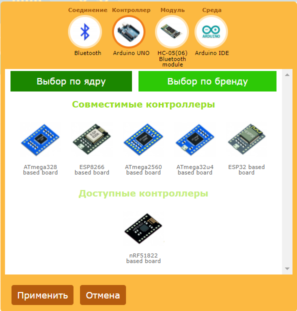

# Конфигурация оборудования

Необходимо настроить конфигурацию вашего оборудования и способ связи между телефоном и контроллером. Вы получите исходный код интерфейса с учетом особенностей вашего оборудования. Настройка осуществляется на вкладках **Конфигурация** и **Подключение модуля** правой панели инструментов.

## Конфигурация

Откройте вкладку **Конфигурация** на правой панели инструментов и кликните в любой элемент списка. Откроется окно выбора конфигурации оборудования. Необходимо установить четыре параметра которые определяют ваше оборудование. 

- **Соединение**. Определяет каким способом ваш контроллер будет подключаться к телефону. 
- **Контроллер**. Определяет какой контроллер вы используете.
- **Модуль связи**. Какой модуль связи вы используете.
- **Среда разработки**. Для какой среды разработки вы хотите получить исходный код.

Что бы выбрать каждый параметр, кликните в круг этого параметра вверху окна, далее в списке выберите необходимый элемент.

Все параметры взаимосвязаны между собой, а некоторые взаимоисключающие. При выборе каждого параметра вы увидите, что список элементов для выбора делится на совместимые и несовместимые. В списке совместимых будут те элементы, которые совместимы с уже выбранными остальными параметрами. В несовместимые, или доступные, попадут элементы которые не подходят к уже выбранным параметрам. Например если вы выбрали способ соединения WiFi, то все модули связи не имеющие WiFi попадут в несовместимые.

Вы можете выбрать любой элемент, как совместимый так и несовместимый. Однако при выборе несовместимого элемента все другие параметры с которыми этот элемент не совместим будут сброшены. Их нужно выбрать заново.

Таким образом редактор отслеживает что бы была выбрана верная конфигурация оборудования которая поддерживается редактором. Если вы не выбрали какой то параметр, вы не сможете применить выбранные настройки.

### Соединение

Для выбора способа соединения кликните по значку **Соединение** в верху окна. 

Подробнее про виды соединений смотрите в разделе [Варианты соединения](https://remotexy.com/en/help/connections/)

### Контроллер

Для выбора контроллера кликните по значку **Контроллер** в верху окна.

Вы можете выбрать контроллер исходя из микросхемы на которой он построен. Для этого нажмите кнопку отбора **Выбор по ядру**. Вы так же можете выбрать контроллер конкретного бренда и конкретную модель, для этого нажмите кнопку отбора **Выбрать по бренду**. 

### Модуль связи

Для выбора модуля связи кликните по значку **Модуль** в верху окна.

Вы можете выбрать как внешний модуль связи, который вы подключаете к вашему контроллеру по проводам, так и интегрированный в чип модуль связи если выбранный контроллер его содержит.

Подключение модуля связи или варианты использования интегрированного модуля связи требуют дополнительных настроек. Эти дополнительные настройки вы сможете сделать после того как закончите выбор конфигурации оборудования.

### Среда разработки

Для выбора среды разработки кликните по значку **Среда** в верху окна.

Выберите среду разработки для которой вы хотите получить исходный код графического интерфейса.

## Настройка модуля связи

Необходимо указать редактору как вы подключили модуль связи к вашему контроллеру и как его необходимо сконфигурировать. Для настройки подключения модуля связи откройте вкладку **Подключение модуля** на правой панели инструментов. 

В зависимости от выбранного варианта соединения и модуля связи вам будут доступны разные свойства. Разные модули связи по разному подключаются к контроллеру и используют разные библиотеки для их работы. Если вы используете внешний модуль связи, то необходимо указать способ его подключения к контроллеру и контакты. Если работа модуля поддерживается специализированной библиотекой, то потребуется указать параметры для конфигурирования этих библиотек. Все эти настройки будут перенесены в исходный код.

