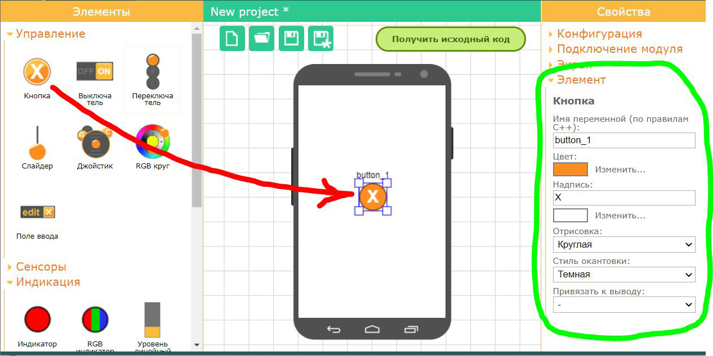
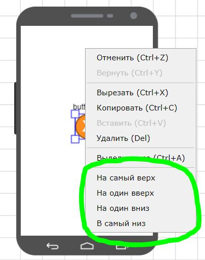

# Элементы графического интерфейса

Используйте поле телефона для размещения визуальных элементов. В левой панели инструментов выберите необходимый элемент и перетащите его в поле телефона при помощи левой кнопки мыши. После того как вы установили элемент в поле телефона, вы можете переместить его в нужное место и изменить его размер. Для изменения размера используйте квадратные зоны в углах области выделения. Вы можете изменить свойства выделенного элемента, развернув вкладку **Элемент** в правой панели управления.

Все элементы делятся на четыре группы. Группы объединяют элементы по некоторым общим свойствам.

- **Управление**. При помощи этих элементов производятся управляющие воздействия. Информация о состоянии элемента направляется с телефона в контроллер.
- **Сенсоры**. При помощи этих элементов вы можете передать в контроллер данные сенсоров вашего телефона.
- **Индикация**. При помощи этих элементов может быть отображена какая либо информация и данные, направленные из контроллера в телефон.
-  **Декорация**. Эти элементы не передают какие либо данные, они необходимы что бы сделать ваш интерфейс более красивым и читаемым.

В последующем, когда вы получите исходный код для контроллера, для всех установленных элементов, будут созданы соответствующие переменные в структуре `RemoteXY`, и вы легко сможете их использовать их в вашей программе.

## Изменение позиции и размера элемента

Каждый установленный элемент может быть перемещен в любое место экрана телефона, может быть изменен размер, а так же свойства элемента.

Для перемещения элемента его необходимо выделить и при помощи левой кнопки мыши переместить.

Для изменения размера элемента его необходимо выделить, далее используя квадратные зоны по углам области выделения левой кнопкой мыши изменить размер элемента.

## Настройка свойств элемента

Для настройки свойств элемент необходимо выделить, затем п правой панели свойств развернуть вкладку **Элемент** и вы увидите какие свойства элемента могут быть изменены. Каждый элемент обладает разным набором свойств. Большинство элементов имеют одинаковые свойства, такие как имя элемента и цвет.

## Имя элемента

Важным свойством элемента является его имя. Имя должно быть уникальным для каждого элемента. На основе имени элемента будет составлено имя переменных в структуре `RemoteXY` в исходном коде. По этому имя переменной необходимо указывать по правилам C++. Имя не должно содержать пробелов, содержать только буквы и цифры и символ подчеркивания. Имя не может начинаться с цифры.

## Уровни отображения

Все элементы рисуются на экране в строгом порядке друг за другом. Это дает возможность помещать одни элементы над другими. Например вы можете элемент **Панель** установить в качестве фона для другого элемента. Для этого нужно элемент **Панель** разместить под этим элементом.

Вы можете двигать элементы по уровням. Для этого нажмите правую кнопку мыши на выделенном элементе, далее в контекстном меню выбираете:

- **На самый верх**. Элемент будет рисоваться последним и закроет собой все ранее нарисованные элементы.
- **На один вверх**. Элемент поднимется на один уровень.
- **На один вниз**. Элемент опустится на один уровень.
- **В самый низ**. Элемент будет рисоваться самым первым и все остальные элементы будут нарисованы поверх него.

## Копирование и удаление элементов

Вы можете скопировать элемент и далее вставить его копию со всеми настроенными свойствами. 

Для копирования выделите элемент, нажмите правую кнопку мыши на выделенном элементе, далее в контекстном меню выбираете **Копировать**. Или нажмите Ctrl+C. Для копирования элемента с его удалением выберите **Вырезать**, или нажмите Ctrl+X.

Для вставки элемента необходимо снять выделение со всех элементов, в нужном месте где вы хотите вставить нажать правую кнопку мыши, в контекстном меню выбрать **Вставить**. Или нажать Ctrl+V. Если вы активируете функцию вставки на выделенном элементе, то будет произведена замена выделенных элементов на копируемый. Выделенные элементы будут удалены, а на их место вставлен копируемый элемент.

Для удаления элемента, нажмите правую кнопку мыши на выделенном элементе, далее в контекстном меню выбираете **Удалить**. Или нажмите Del. 

