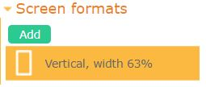
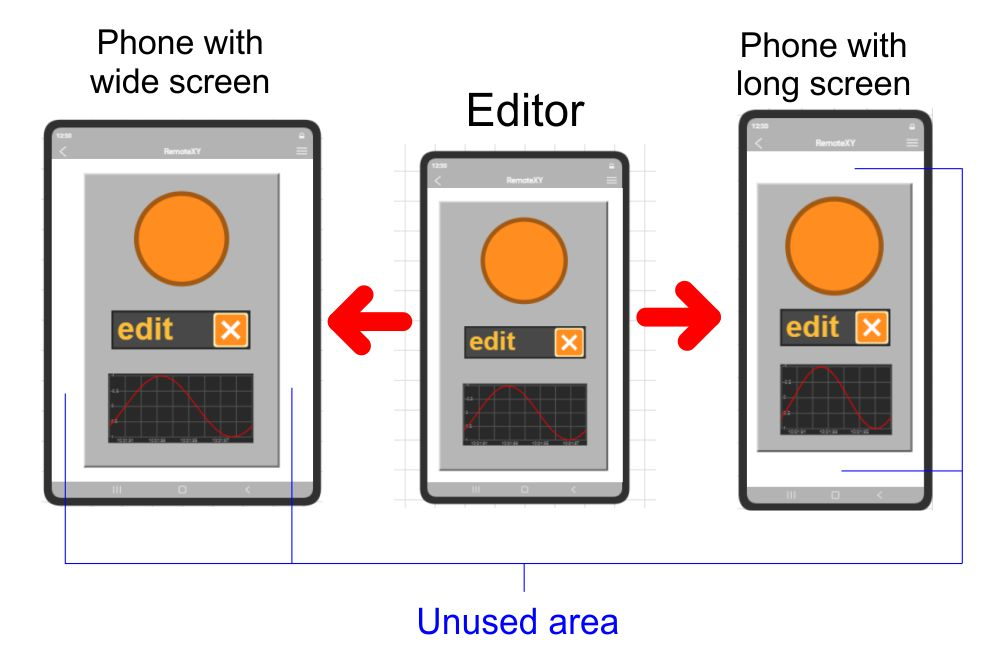
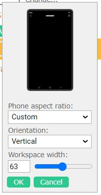
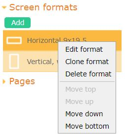

# Screen formats

The configuration of screen formats is performed on the **Screen formats** tab of the right control panel. 

You can create support for one or more different screen formats for your graphical interface.

You can create both vertical and horizontal orientation screens. You can create multiple screens with different widths.

When opening your graphical interface in the application, the app will automatically choose the format that best fits the screen width of the specific device.

You can still be confident that your graphical interface will fit any screen, even if you haven't created a specific format for that screen. In this case, the graphical interface will be fitted into the screen rectangle, leaving unused areas at the edges. These areas will be colored with the background color. If the selected screen format is only slightly different, these unused areas will be small and inconspicuous.

If you want to have support for the maximum possible number of devices with different screen formats, the best solution is to create multiple formats.

### Screen orientation

If you have added multiple formats, including both vertical and horizontal, the application will be able to change the displayed format according to the phone's orientation.

If you have chosen only vertical formats, the phone will display the graphical interface in portrait orientation. The portrait mode will remain even if you turn the phone sideways.

If you have chosen only horizontal formats, the phone will display the graphical interface in landscape orientation. The landscape mode will remain even if you turn the phone upright.

### How to add a new screen format

To add a screen format, press the **Add** button. The screen format editing dialog will open.

You can set the screen orientation as well as its width or height in percentage.

You should understand that when setting the width or height, you are not configuring the physical screen of the smartphone but rather the working area allocated for the interface. Some areas of the physical screen may contain the navigation bar and system bar used by the operating system. Consequently, the interface is allocated less space on the physical screen.

### How to change or remove screen format

If you want to modify or delete a format, right-click on the format, and from the dropdown menu, choose the desired action.

### How to select the current screen format

To select the current screen format you want to edit, left-click on the respective format on the **Screen formats** tab of the right control panel.

### How to arrange elements on different screen formats

Any graphical interface element you have set will be present on all screen formats you have created.

You need to manually adjust the sizes and positions of each element on each screen format.

You can use the format cloning feature to create a new screen with a different width. In this case, the positions of all elements will be copied to the new format, and their sizes will be adjusted as much as possible.

