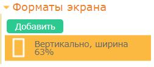
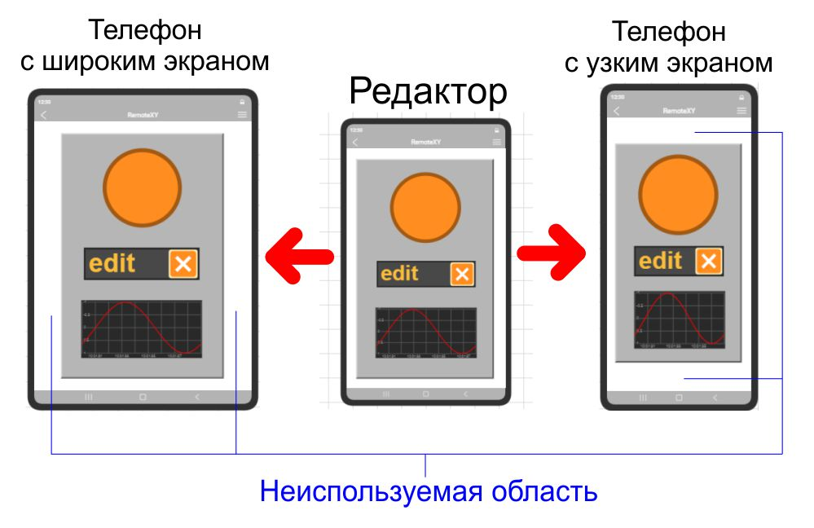
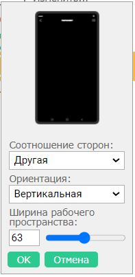
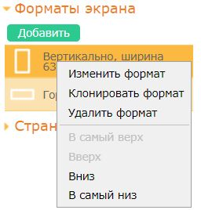

# Форматы экрана

Настройка форматов экрана осуществляется на вкладке **Форматы экрана** правой панели управления. 

Вы можете создать поддержку одного или нескольких различных форматов экрана для вашего графического интерфейса.

Вы можете создавать как экраны вертикальной ориентации, так и горизонтальной. Вы можете создать несколько экранов различной ширины. 

При открытии вашего интерфейса в приложении, приложение само выберет какой из ваших форматов наиболее подходит под ширину экрана конкретного устройства и выберет ее. 

Вы все равно можете быть уверены что ваш интерфейс поместится в любой экран, даже если вы не создали специального формата для этого экрана. В этом случае интерфейс будет вписан в прямоугольник экрана, но по краям останутся неиспользуемые области. Эти области будут окрашены в цвет фона. Если выбранный формат экрана отличается незначительно, то эти неиспользуемые области будут достаточно маленькими и незаметными.

Если вы хотите иметь поддержку максимально возможного количества устройств с разными форматами экрана, лучшим решением будет создать несколько форматов.

### Ориентация экрана

Если вы добавили несколько форматов среди которых есть и вертикальный и горизонтальный, то приложение сможет изменять отображаемый формат в соответствии с ориентацией телефона.

Если вы выбрали только вертикальные форматы, то телефон отобразит интерфейс в портретной ориентации. Портретный режим останется даже если вы повернете телефон на бок.

Если вы выбрали только горизонтальные форматы, то телефон отобразит интерфейс в ландшафтной ориентации. Ландшафтный режим останется даже если вы повернете телефон прямо.

### Как добавить новый формат экрана

Что бы добавить формат экрана нажмите кнопку **Добавить**. Откроется окно редактирования формата нового экрана.

Вы можете установить ориентацию экрана а так же его ширину или высоту в процентном отношении.

Вы должны понимать что вы устанавливаете ширину или высоту не физического экрана смартфона, а рабочей области которая выделяется для интерфейса. Некоторые области экрана могут размещать области навигации и информации которые использует операционная система. И для интерфейса выделяется меньше места на физическом экране.

### Как изменить или удалить формат экрана

Если вы хотите изменить формат или удалить его, кликните правой кнопкой мыши по формату и из выпадающего меню выберите необходимое действие.

### Как выбрать текущий формат экрана

Что бы выбрать текущий формат экрана который вы хотите редактировать, кликните левой кнопкой мыши в соответствующий формат на вкладке **Форматы экрана** правой панели управления

### Как размещать элементы на разных форматах экрана

Любой элемент интерфейса который вы установили, обязательно присутствует на всех форматах экрана которые вы создали.

Вы должны вручную изменить размеры и положение каждого элемента на каждом формате экрана.

Вы можете воспользоваться функцией клонирования формата что бы создать новый экран другой ширины. При этом положения всех элементов будут скопированы на новый формат и насколько это возможно будут изменены их размеры.

