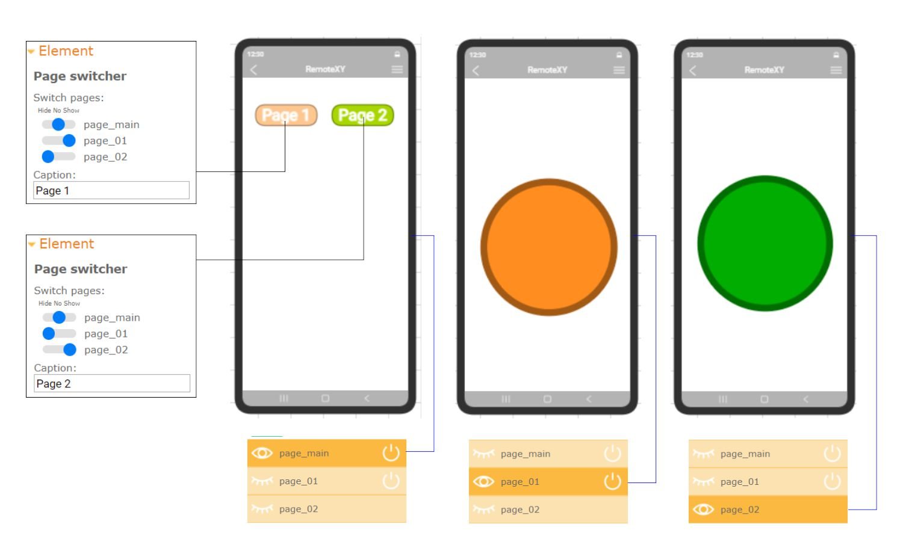
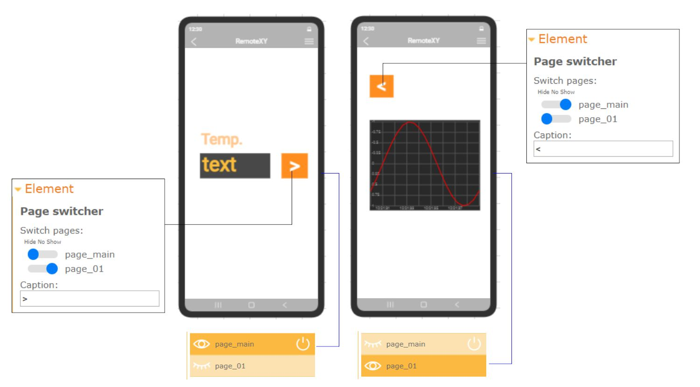
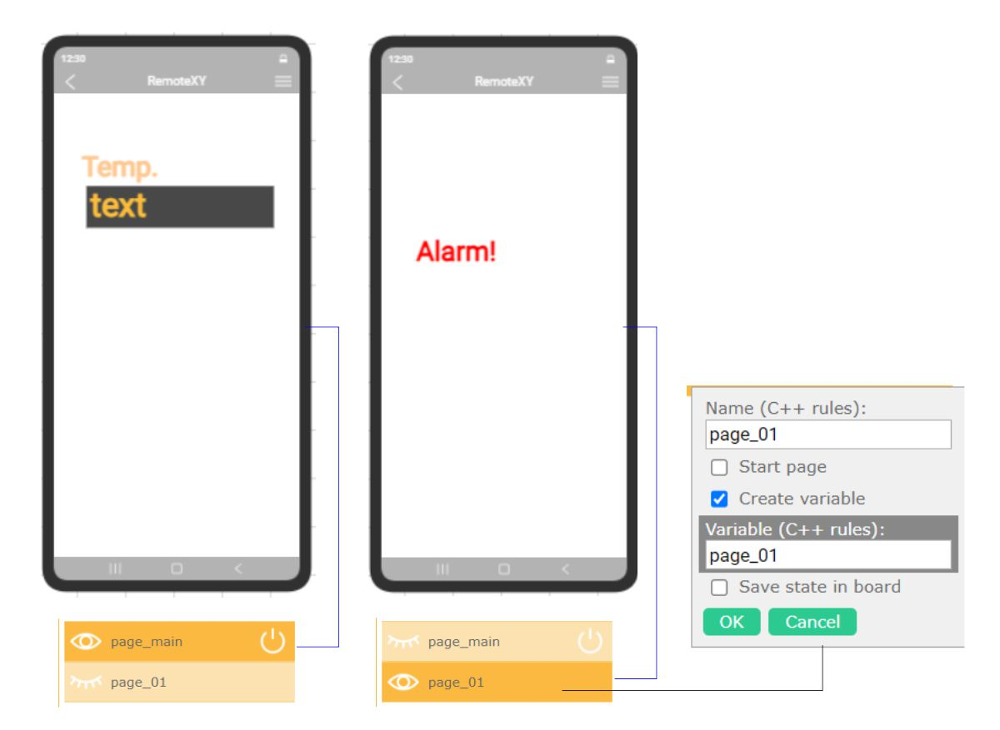

# Использование страниц

Ниже приведены несколько практик как вы можете использовать страницы. Вы можете комбинировать эти практики.

### Свободное переключение между страницами

Если вы хотите иметь две или несколько страниц в вашем графическом интерфейсе и хотите в произвольном порядке переключаться между ними.

Для этого создайте одну общую страницу на которой разместите все переключатели страниц и создайте страницы для элементов которые будут отображаться и скрываться. 

Общая страница всегда должна оставаться видимой. Сделайте эту страницу стартовой. Одну из страниц для элементов так же сделайте стартовой, именно эта страница будет открываться при запуске графического интерфейса.

Измените свойства переключателей страниц таким образом что бы при нажатии на него отображалась общая страница и страница с соответствующими элементами, а все остальные страницы скрывались.

Таким образом общая страница всегда будет оставаться видимой и переключатели всех страниц так же будут видимыми на любой странице. 

### Страница дополнительных параметров с кнопкой возврата

Вы можете перенести дополнительную информацию на отдельную страницу которая открывается когда это необходимо.

Для этого на главной странице размещаются переключатели страниц ведущие на дополнительную страницу. А на дополнительной странице разместите переключатель страниц ведущий на главную страницу. Сделайте его внешний вид похожим на кнопку Назад.

### Управление видимостью элементов

При помощи страниц вы можете управлять видимостью элемента или группы элементов из контроллера.

Для этого разместите на отдельной странице элементы видимостью которых вы хотите управлять . Странице присвойте переменную. Изменяя переменную в контроллере вы можете отображать или скрывать элементы прямо из контроллера.

