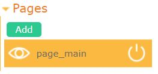
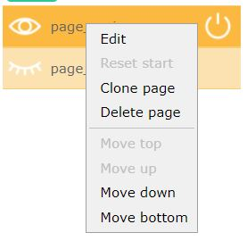
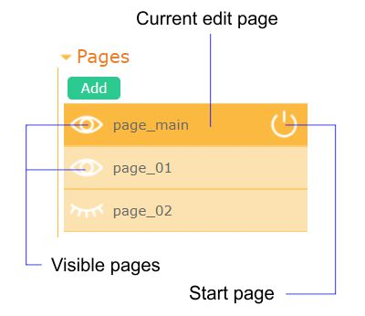
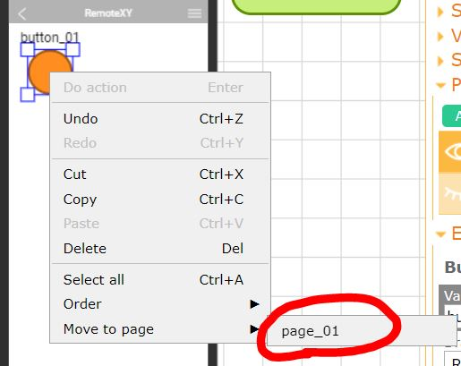
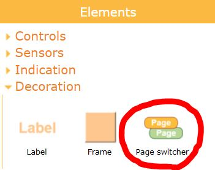

# Pages

The configuration of screen formats is performed on the **Pages** tab of the right control panel. 



The graphical interface supports placing elements on different pages. Pages can be displayed and hidden in any order. In this case, all other graphical interface elements located on the page will be hidden or displayed.

There are two ways to enable and disable pages:

- Use a special control element called **Page switcher**;
- Control the display of pages from the controller board through variables.

### How to add a page

To add a new page, click the **Add** button. The dialog window for editing the new page will open.


Next, specify the following settings:

- **Name:** Set according to C++ variable naming conventions. It must be unique among pages.
- **Start page:** Check if the page should be displayed when launching the graphical interface. Uncheck if the page should be hidden.
- **Create variable:** Check if you want to have a variable in the controller board that reflects the visibility state of the page.
- **Variable:** When checking the **Create variable** checkbox, specify the variable name according to C++ variable naming conventions.
- **Save state in board:** If checked, the visibility state of the page will be read from the controller's corresponding variable when launching the graphical interface.

### How to change settings or delete a page

If you want to modify the parameters of a page or delete it, right-click on the page, and from the dropdown menu, choose the desired action.



### How to select the current page

To select the current page for editing, left-click on the respective page on the **Pages** tab of the right control panel.

Any new interface element you add will be placed on the currently edited page. Additionally, pasting an element from the clipboard will be done on the current page.

### How to hide or show a page in the editor


To hide or show a particular page in the editor, click on the eye icon next to the corresponding page on the **Pages** tab of the right control panel. An open eye indicates that the page is visible, while a closed eye indicates that the page is not visible in the editor.

You can toggle the visibility of any number of pages. However, the currently edited page will always remain visible. If you want to hide the currently edited page, you need to first select another page for editing.



### How to move elements to another page

To move graphical interface elements to another page, you need to select these elements. Then, right-click on the selection, choose the option **Move to page** from the opened menu, and select the new page for the elements.




### Page switcher

To switch between pages during the operation of the graphical interface, a special control element called the **Page Switch** is used. This element is specifically designed to enable or disable visible pages during the use of the graphical interface. For more details on how to configure this element, refer to the [relevant section in the documentation](/elements/page/en.md).



### Using a page variable

If a page has a variable, this variable will be reflected in the RemoteXY source code structure. The variable type is **uint8_t**. By using this variable, you can track the visibility state of the page. The variable values can be as follows:

- = 0 - the page is hidden and not displayed;
- = 1 - the page is displayed.


### Changing page visibility from the board

By using the page variable, you can control the visibility of the page from the controller's program. To do this, assign the appropriate value to this variable: 0 to hide the page and 1 to display the page.

```
  if (needShowPage) {
    RemoteXY.page_01 = 1;
  }
  else {
    RemoteXY.page_01 = 0;    
  }
```

### Save page visibility in the board

You can implement a scenario where, upon connecting to the controller and opening the graphical interface, the pages that were open in the previous connection session will be displayed. This is possible if such pages have a variable and the **Save state in board** option is enabled.

During the operation of the graphical interface, the current visibility state of pages is transmitted to the controller and displayed in the corresponding variables. If the connection is interrupted, the variables in the controller continue to store the visibility state of pages. When reconnecting to the controller, the application will read these variables and set the states from these variables as the initial states for the pages.

You can use this mechanism for all pages or selectively for a few pages.