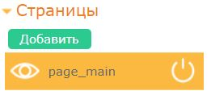
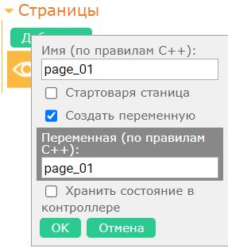
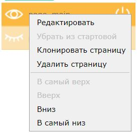
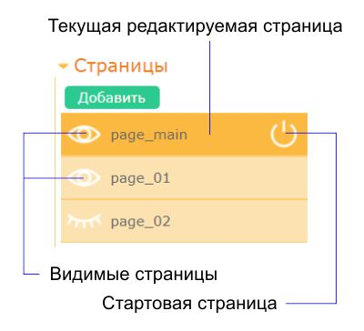
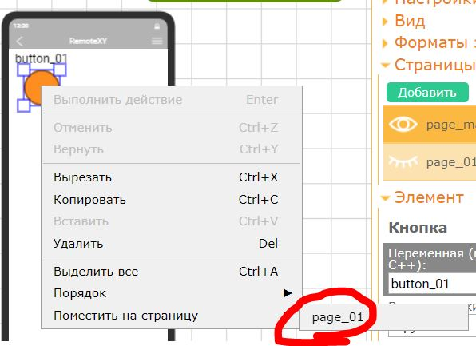
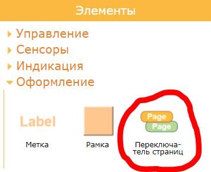

# Страницы

Настройка страниц осуществляется на вкладке **Страницы** правой панели управления.



Графический интерфейс поддерживает размещение элементов на разных страницах. Страницы могут отображаться и скрываться в произвольном порядке. При этом все другие элементы графического интерфейса расположенные на странице будут скрываться или отображаться. 

Для включения и выключения страниц существует две возможности:

- Использовать специальный элемент управления **Переключатель страниц**;
- Управление отображением страниц из контроллера через переменные.

### Как добавить страницу

Что бы добавить новую страницу нажмите кнопку **Добавить**. Откроется диалоговое окно редактирования новой страницы.



Далее укажите следующие настройки:

- **Имя страницы**. Задается по правилам именования переменных C++. Должно быть уникально среди страниц.
- **Стартовая страница**. Установите флажок если страница должна отобразиться при запуске графического интерфейса. Если страница должна быть скрыта то снимите флажок.
- **Создать переменную**. Установите флажок если вы хотите иметь переменную в контроллере отображающую состояние видимости страницы. 
- **Переменная**. При установке флажка **Создать переменную** необходимо указать имя для переменной по правилам именования переменных C++.
- **Хранить состояние в контроллере**. Если флажок установлен, то при запуске графического интерфейса состояние видимости страницы будет считано из в контроллера из соответствующей переменной. 

### Как изменить параметры или удалить страницу

Если вы хотите изменить параметры страницы или удалить еe, кликните правой кнопкой мыши по странице и из выпадающего меню выберите необходимое действие.



### Как выбрать текущую страницу

Что бы выбрать текущую страницу для редактирования, кликните левой кнопкой мыши в соответствующую страницу на вкладке **Страницы** правой панели управления.

Установка любого нового элемента в интерфейс будет произведена в текущую редактируемую страницу. Так же вставка элемента из буфера обмена будет выполнена на текущую страницу.

### Как скрыть или отобразить страницу в редакторе

Что бы скрыть или отобразить какую либо страницу в редакторе, кликните на значок глаза соответствующей страницы во вкладке **Страницы** правой панели управления. Открытый или закрытый глаз показывает видима или не видима соответствующая страница в редакторе.

Вы можете включить или отключить видимость произвольного количества страниц. При этом текущая страница для редактирования всегда останется видимой. Если вы хотите скрыть текущую редактируемую страницу необходимо сначала выбрать другую редактируемую страницу.



### Как перенести элементы на другую страницу

Что бы перенести элементы графического интерфейса на другую страницу необходимо выделить эти элементы, далее правой кнопкой мыши щелкнуть по выделению, в открывшемся меню выбрать пункт **Перенести на страницу** и выбрать новую страницу для элементов.




### Переключатель страниц

Для переключения страниц в процессе работы графического интерфейса служит специальный элемент управления **Переключатель страниц**. Элемент специально предназначен для включения или отключения видимых страниц в процессе использования графического интерфейса. Подробнее как настроить элемент смотрите в [соответствующем разделе инструкции](/elements/page/ru.md).



### Использование переменной страницы

Если страница имеет переменную, то эта переменная будет отражена в структуре RemoteXY исходного кода для контроллера. Тип имеет тип **uint8_t**. Используя данную переменную вы можете отслеживать состояние видимости страницы. Значения переменной могут быть следующие:

- = 0 - страница скрыта и не отображается;
- = 1 - страница отображается.


### Изменение видимости страницы из контроллера

Используя переменную страницы вы можете управлять видимостью страницы из программы контроллера. Для этого присвойте этой переменной соответствующее значение: 0 что бы скрыть страницу и 1 что бы отобразить страницу.

```
  if (needShowPage) {
    RemoteXY.page_01 = 1;
  }
  else {
    RemoteXY.page_01 = 0;    
  }
```

### Сохранение видимости страницы в контроллере

Вы можете реализовать сценарий когда при подключении к контроллеру и открытии графического интерфейса будут отображаться те страницы которые были открыты в предыдущем сеансе соединения. Это возможно если такие страницы будут иметь переменную и установленный признак **Хранить состояние в контроллере**. 

При работе графического интерфейса текущее состояние видимости страниц передается на контроллер и отображается в соответствующих переменных. Если соединение разорвано, то переменные в контроллере продолжают сохранять состояние видимости страниц. При новом подключении к контроллеру приложение прочитает эти переменные и установит для страниц состояния из этих переменных как стартовые.

Вы можете использовать этот механизм для всех страниц или выборочно для нескольких страниц.
