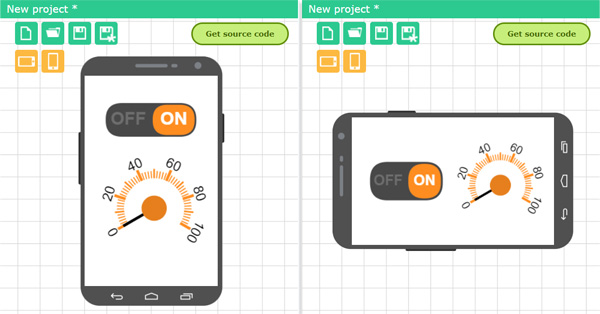

# View settings

View settings are configured on the **View** tab on the right toolbar. You can set the background color and screen orientation.

The screen orientation can be as follows:

- Vertical. When the interface is displayed, it will always be portrait, even if you rotate the phone.
- Horizontal. When the interface is displayed, it will always be in a horizontal, even if you rotate the phone.
- Both. When you rotate the phone, the interface will also rotate to a vertical or horizontal version.

### Features for two orientations

If you have chosen to orient the interface in both variants, you need to place all elements in two variants: vertical and horizontal. Buttons for selecting the current orientation will be displayed next to the phone field. By clicking on these buttons you can switch between orientations.

You do not need to set separate elements for each orientation. Any element will be placed in two orientations at once. All properties of the elements will be the same, since in fact they are one and the same element. You can only change the size of the element and its position on the screen.

