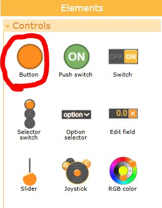
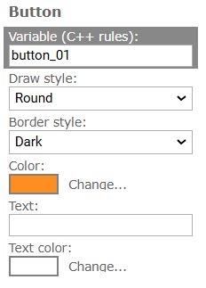
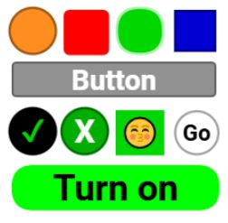

# Button

The **Button** control element allows the user to click it to perform a specific action. Information about the **Button** press is transmitted to the board. The **Button** can have different shapes and colors and may contain text.

**The button** is located on the **Control** tab of the left panel of the editor. Click the mouse on the button image and drag it onto the editor screen.



### Data

| Data               | Type    | Value                                                        |
| ------------------ | ------- | ------------------------------------------------------------ |
| Button press state | uint8_t | 0 - the button is not pressed<br />1 - the button is currently pressed |

### Configuration



- **Variable.** Specifies the name of the variable that will be bound to the button. The name is set according to the rules for naming C++ variables.
- **Draw style.** Specifies the appearance of the button.
- **Border style.** Specifies the border style of the button.
- **Color.** The color of the button.
- **Text.** Specifies the text placed on the button.
- **Text color.** The color of the text .

### Display options



As a text, you can use special encoding characters, such as emojis. To do this, find the symbol you need, for example, in a browser on any website, and copy it into the **Text** field in the element settings.

### How it works

When the user touches and presses the  button, the press state is transmitted to the board through an associated variable. When the button is not pressed, the variable's value is 0. When the button is pressed, the variable's value is 1.

If the button is pressed and released very quickly, this brief press will also be transmitted to the board. In such cases, the variable will have a value of 1 for the duration of a single board cycle.

### Source code examples

Check the state of the button.

```
void loop () {
  RemoteXY_Handler ();
  
  if (RemoteXY.button != 0) {
    // TODO now the button is pressed
  }
  else {
    // TODO now the button is not pressed
  }
}
```

Get the moment when the button is pressed.

```
uint8_t prevButtonState = 0;

void loop () {
  RemoteXY_Handler ();
  
  if ((RemoteXY.button != 0) && (prevButtonState == 0)) {
    // TODO the moment when the button is pressed
  }
  prevButtonState = RemoteXY.button;
}
```

Change the state of the output pin.

```
#define PIN_BUTTON 13

void setup () {
  pinMode(PIN_BUTTON, OUTPUT);
}

void loop () {
  RemoteXY_Handler ();
  
  if (RemoteXY.button!=0) digitalWrite(PIN_BUTTON, HIGH);
  else digitalWrite(PIN_BUTTON, LOW);
} 
```


