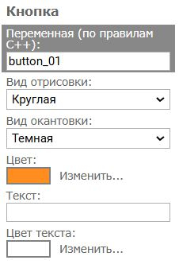

# Кнопка

Элемент управления **Кнопка** позволяет пользователю щелкнуть его для выполнения какого либо действия. Информация о нажатии **Кнопки** передается в контроллер. **Кнопка** может иметь разную форму и цвет, может содержать текст.

**Кнопка** находится на вкладке **Управление** левой панели редактора. Щелкните мышкой в изображение кнопки и переместите ее на экран редактора.


### Данные

| Данные                   | Тип     | Значение                                                    | Направление |
| ------------------------ | ------- | ----------------------------------------------------------- | ----------- |
| Состояние нажатия кнопки | uint8_t | 0 - кнопка не нажата<br />1 - кнопка нажата в данный момент | input       |

### Настройка



- **Переменная**. Указывается имя переменной которая будет привязана к кнопке. Имя задается по правилам именования переменных C++. 
- **Вид отрисовки.** Указывается внешний вид кнопки. 
- **Вид окантовки.** Указывается вид рамки кнопки.
- **Цвет.** Указывается цвет кнопки.
- **Текст**. Указывается текст размещенный на кнопке.
- **Цвет текста.** Указывается цвет текста размещенного на кнопке.

### Варианты отображения


В качестве надписи допускается использование специальных символов кодировки, например смайликов. Для этого найдите нужный вам символ, например в браузере на любом сайте, и скопируйте его в поле настройки элемента **Надпись**.

### Описание работы

Когда пользователь касается кнопки и нажимает ее, состояние о нажатии кнопки передается в контроллер через связанную переменную. Когда кнопка не нажата значение переменной равно 0. Когда кнопка нажата значение переменной равно 1.

Если кнопка будет нажата и отпущена очень быстро, то такое кратковременное нажатие будет так же передано в контроллер. В этом случае переменная будет равна 1 в течении одного цикла работы контроллера.

### Примеры исходного кода

Проверить состояние кнопки.

```
void loop () {
  RemoteXY_Handler ();
  
  if (RemoteXY.button != 0) {
    // TODO сейчас кнопка не нажата
  }
  else {
    // TODO сейчас кнопка нажата
  }
}
```

Получить момент нажатия кнопки

```
uint8_t prevButtonState = 0;

void loop () {
  RemoteXY_Handler ();
  
  if ((RemoteXY.button != 0) && (prevButtonState == 0)) {
    // TODO ловим момент нажатия кнопки
  }
  prevButtonState = RemoteXY.button;
}
```

Изменить состояние выходного контакта контроллера

```
#define PIN_BUTTON 13

void setup () {
  pinMode(PIN_BUTTON, OUTPUT);
}

void loop () {
  RemoteXY_Handler ();
  
  if (RemoteXY.button != 0) {
    digitalWrite(PIN_BUTTON, HIGH);
  }
  else {
    digitalWrite(PIN_BUTTON, LOW);
  }
} 
```


