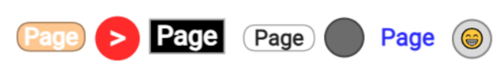

# Page switcher

Page switch is a special control element designed solely to change the visibility of pages in the graphical interface. The element is located on the **Decoration** tab of the left panel of the editor.

### Data

The element does not communicate with the board.

### Configuration

- **Switch pages.** Specifies the action for each project page when the element is pressed. The action switch has three positions: hide the page, do nothing, show the page.
- **Caption.** Specifies the label located on the page switch button.
- **Draw style.** Specifies the appearance of the page switch button: circular, oval, rectangular, with rounded corners.
- **Border style.** Specifies the border style of the page switch button.
- **Color.** The color of the button in the inactive state.
- **Active color.** The color of the button in the active state. The active state is determined by the correspondence of the currently displayed pages to the **Switch pages** setting of this element.
- **Text color.** The color of the label.

### Display options

As a label, you can use special encoding characters, such as emojis. To do this, find the symbol you need, for example, in a browser on any website, and copy it into the **Caption** field in the element settings.

### How it works

During the operation of the graphical interface, pressing the element will show or hide pages according to the **Switch pages** setting.

To quickly make the pages controlled by the page switch visible or hidden, you can select the switch and press **Enter**. Alternatively, right-click on the element and choose **Switch pages** from the context menu.

The element has two display colors: normal color and activation color. If the current display of pages corresponds to the pages you configured in the **Switch pages** setting, the color of the element's button will change to the activation color. When you click on the page switch element, the visibility of pages will be set according to the settings of this element, and consequently, the page switch will change its color to the activation color.

