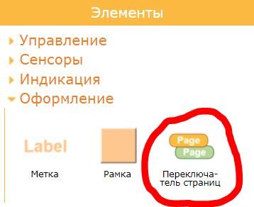
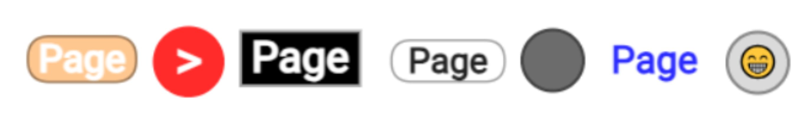

# Переключатель страниц

Переключатель страниц это специальный элемент управления единственным назначением которого является изменение видимости страниц графического интерфейса. Элемент находится на вкладке **Оформление** левой панели редактора.

### Данные

Элемент не осуществляет обмен данными с контроллером

### Настройка

- **Переключить страницы**. Задается действие для каждой страницы проекта при нажатии на элемент. Переключатель действия имеет три положения: скрыть страницу, ничего не делать, отобразить страницу.
- **Надпись.** Указывается надпись расположенная на кнопке переключателя страниц. 
- **Вид отрисовки**. Указывается вид отображения кнопки переключателя страниц: круглая, овальная, прямоугольная, со скругленными углами.
- **Вид окантовки.** Указывается вид окантовки кнопки переключателя страниц.
- **Цвет.** Цвет кнопки в неактивном состоянии.
- **Цвет активации.** Цвет кнопки в активном состоянии. Активное состояние определяется по соответствию текущих отображаемых страниц настройке **Переключить страницы** данного элемента.
- **Цвет текста.** Цвет надписи.

### Варианты отображения

В качестве надписи допускается использование специальных символов кодировки, например смайликов. Для этого найдите нужный вам символ, например в браузере на любом сайте, и скопируйте его в поле настройки элемента **Надпись**.

### Описание работы

При работе графического интерфейса, при нажатии на элемент будут отображены и скрыты страницы в соответствии с настройкой **Переключить страницы**. 

В редакторе, что бы быстро сделать видимыми и скрыть страницы которыми управляет переключатель страниц, вы можете выделить переключатель и нажать **Enter**. Или щелкнуть правой кнопкой мыши в элемент и в контекстном меню выбрать **Переключить страницы**.

Элемент имеет два цвета отображения, обычный цвет и цвет активации. Если текущее отображение страниц соответствует страницам которые вы настроили в настройке **Переключить страницы**, то цвет кнопки элемента изменится на цвет активации. При щелчке по элементу переключателя страниц видимость страниц установится в соответствии с настройкой этого элемента и как следствие переключатель страниц изменит свой цвет на цвет активации.

