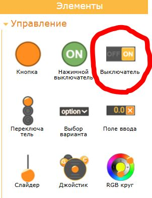
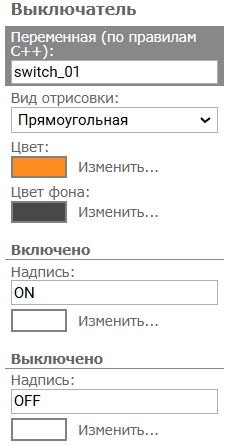
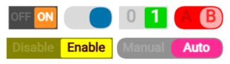

# Выключатель

Элемент управления **Выключатель** имеет два состояния, например "Выключено" и "Включено". Пользователь пальцем изменяет положение движка выключателя изменяя его состояние для выполнения какого либо действия. Информация о состоянии **Выключателя** передается в контроллер. **Выключателя** может иметь разную форму и цвет, может содержать текст.

**Выключатель** находится на вкладке **Управление** левой панели редактора. Щелкните мышкой в изображение кнопки и переместите ее на экран редактора.



### Данные

| Данные                | Тип     | Значение                                                     | Направление |
| --------------------- | ------- | ------------------------------------------------------------ | ----------- |
| Состояние выключателя | uint8_t | 0 - выключено, выключатель в положении влево , <br />1 - включено, выключатель в положении вправо | input       |

### Настройка



- **Переменная**. Указывается имя переменной которая будет привязана к кнопке. Имя задается по правилам именования переменных C++. 

- **Вид отрисовки.** Указывается внешний вид кнопки. 

- **Цвет.** Указывается цвет бегунка выключателя.

- **Цвет фона.** Указывается цвет фона выключателя.

  ##### Включено

- **Надпись**. Указывается текст и цвет надписи размещенный на правом положении выключателя, когда выключатель включен.

  ##### Выключено

  **Надпись**. Указывается текст и цвет надписи размещенный на левом положении выключателя, когда выключатель выключен.

### Варианты отображения



В качестве надписи допускается использование специальных символов кодировки, например смайликов. Для этого найдите нужный вам символ, например в браузере на любом сайте, и скопируйте его в поле настройки элемента **Надпись**.

### Описание работы

Когда пользователь перемещает движок выключателя в правое или левое положение, состояние выключателя изменяется. Состояние выключателя передается в контроллер через связанную переменную. При изменении положения выключателя в графическом интерфейсе значение связанной переменной будет изменено. Когда выключатель в левом положении то он выключен, значение переменной равно 0. Когда выключатель в правом положении то он включен, значение переменной равно 1.

##### Изменить состояние из контроллера

Состояние переключателя может быть изменено из контроллера. Для этого необходимо записать значение состояния выключателя в связанную переменную. ***Внимание**.* Если вы будете записывать новое значение выключателя в переменную постоянно в каждом цикле, тогда пользователь не сможет переключить его. Изменяйте состояние выключателя на стороне контроллера только тогда и в тот момент времени когда это необходимо, делайте это один раз.

##### Задать начальное состояние

Вы можете задать начальное состояние выключателя при старте контроллера. Это можно сделать записав начальное значение в связанную переменную. Этот код необходимо разместить в функции `setup ()`.

```
void setup () {
  RemoteXY_Init ();  
  RemoteXY.switch = 1; 
}
```

### Примеры исходного кода

Проверить состояние выключателя.

```
void loop () {
  RemoteXY_Handler ();
  
  if (RemoteXY.switch != 0) {
    // TODO сейчас выключатель включен
  }
  else {
    // TODO сейчас выключатель выключен
  }
}
```

Получить момент изменения состояния

```
uint8_t prevSwitchState = 0;

void loop () {
  RemoteXY_Handler ();
  
  if (RemoteXY.switch != prevSwitchState) {
    if (RemoteXY.switch != 0) {
      // TODO ловим момент когда включили
    }
    else {
      // TODO ловим момент когда выключили
    }    
  }
  prevSwitchState = RemoteXY.switch;
}
```

Изменить состояние выходного контакта контроллера

```
#define PIN_SWITCH 13

void setup () {
  pinMode(PIN_SWITCH, OUTPUT);
}

void loop () {
  RemoteXY_Handler ();
  
  if (RemoteXY.switch != 0) {
    digitalWrite(PIN_SWITCH, HIGH);
  }
  else {
    digitalWrite(PIN_SWITCH, LOW);
  }
} 
```

Изменить состояние выключателя в графическом интерфейсе

```
uint8_t getMotorState () {
  // TODO return текущее состояние мотора, 0 или 1
}

uint8_t prevMotorState = 0;

void loop () {
  RemoteXY_Handler ();
  
  if (prevMotorState != getMotorState ()) {
    // изменяем только в момент когда мотор включился или выключлся
    RemoteXY.switch = getMotorState ();
  }
  prevMotorState = getMotorState ();
}
```

Управление включением и выключением мотора. Мотор может быть включен как из графического интерфейса так и автоматически из программы управления по какому то условию. При этом необходимо когда мотор включается автоматически, что бы в интерфейсе изменилось состояние выключателя.

```

uint8_t getMotorState () {
  // TODO return текущее состояние мотора, 0 или 1
}
void setMotorOn () {
  // TODO действия для включить мотора
}
void setMotorOff () {
  // TODO действия для выключения мотора
}

uint8_t prevMotorState = 0;
uint8_t prevSwitchState = 0;

void loop () {
  RemoteXY_Handler ();
  
  if (prevMotorState != getMotorState ()) {
    RemoteXY.switch = getMotorState ();
  }
  prevMotorState = getMotorState ();
  
  if (RemoteXY.switch != prevSwitchState) {
    if (RemoteXY.switch != getMotorState ()) {
      if (RemoteXY.switch != 0) {
        setMotorOn ();
      }
      else {
        setMotorOff ();
      }
    }
  }
  prevSwitchState = RemoteXY.switch;

}
```

### 
