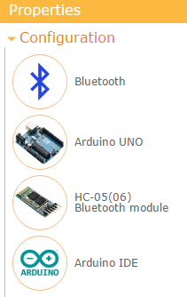
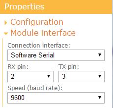
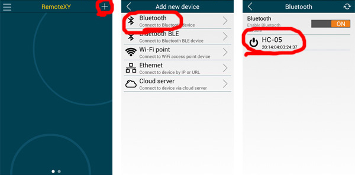

# Arduino UNO + HC-05 Bluetooth module

This step-by-step tutorial will show you how to launch the RemoteXY graphical interface on the Arduino UNO board using the HC-05 or HC-06 Bluetooth communication module. This tutorial can also be used for Arduino Nano, Arduino Mini and compatible controllers.

> Note. IOS devices do not support classic Bluetooth HC-05 (06) modules. You can use the BLE HM-10 module instead.

## Step 1. Create Graphical interface

Go to [RemoteXY editor](https://remotexy.com/ru/editor/). Find the **Button** element on the left toolbar. Drag it to the phone screen. Select the **button**, you will see a frame around it. With the button selected, in the right toolbar, open the **Element** tab. Find **Snap to pin** setting and select **13(LED)** value.

> Note. The editor allows you to specify pin for some elements that can uniquely determine the state of the pin, such as high or low level. However, the best solution would be to write your own code to control the controller pins.

## Step 2. Configure project

Open the **Configuration** tab on the right toolbar. Click on any item in the list, the configuration settings window will open. The configuration setting allows you to specify the options for your board and the connection method. Select the following settings and click the **Apply** button:

- Connection: **Bluetooth**
- Board: **Arduino UNO**
- Module: **HC-05 Bluetooth module**
- IDE: **Arduino IDE**

The configuration tab should look like the picture:

Open the **Module interface** tab and set the following settings values:

- Connection interface: Software Serial
- RX pin: 2
- TX pin: 3
- Speed (baud rate): 9600

The settings determine that the HC-05 (06) module connects to the Arduino through the SoftwareSerial library at 9600 and uses pins 2 and 3. 

> Note. The 9600 baud rate is the default baud rate for the HC-05 and HC-06 Bluetooth modules. Do not select a different speed.

## Step 3. Get the source code for Arduino

Press **Get source code** button.

On the page that opens, click the **Download code** link and download the archive of the sketch for Arduino IDE. Unpack this archive. The archive contains a file `project.ino`, open it in Arduino IDE.

To compile the sketch, you need to add the [RemoteXY library](https://remotexy.com/ru/library/) to the Arduino IDE. Go to the download link for the library and follow the tutorial to install it.

In the Arduino IDE settings, select the **Arduino UNO** board and try compiling the sketch. If you did everything correctly, the sketch should compile without errors.

## Step 4. Connect HC-05 to Arduino Uno

Connect the HC-05 or HC-06 Bluetooth module to the Arduino Uno according to the diagram shown in the image below. Note that pin 2 of the Arduino board selected as RX connects to the TX pin of the Bluetooth module, and pin 3 of the Arduino board selected as TX connects to the RX pin of the Bluetooth module.

## Step 5. Upload the sketch to Arduino board.

Upload the sketch to the board in the usual way. Connect the Arduino UNO board to your computer, select the COM port to which the board is connected and click the download button.

## Step 6. Connect to the board using the mobile app.

Install the [RemoteXY mobile app](https://remotexy.com/ru/download/) to your phone.

Launch the application and click the **+** (Plus) button on the top navigation bar. In the window that opens, select a Bluetooth connection.

If Bluetooth is disabled on your phone, turn it on. Click the refresh button on the top navigation bar to start searching the list of available devices. Bluetooth module HC-05 (HC-06) can have one of the following names: “HC-05”, “HC-06”, “INVOR”. Click to it. A window for entering the password for pairing Bluetooth devices will open. The default password for HC-05 (HC-06) can be 1234 or 0000. Enter the password.

After entering the password, the connection will start. If you did everything correctly, you should see a graphical interface with a button, exactly the same as you designed it on editor. Try click the button. Holding the button down should light up the LED on the Arduino UNO board.

> Note: In the iOS app, Bluetooth must be turned on using the system settings.

## If not connecting...

If the connection fails, check yourself against the list below. This will help you find the error.

### The HC-05 module is not displayed in the device list of app

If you don't see your module in the list of available Bluetooth devices, try pressing the refresh button again to search for devices after a few seconds. If the module still does not appear, the following reasons are possible:

- You have not turned on Bluetooth on your phone.
- No power is supplied to the Bluetooth module. The power supply may not be connected correctly.
- Bluetooth module defective.

### Bluetooth device not found

If you see an error message `Bluetooth device not found`  or `Bluetooth device connection error`, this means that the phone could not find the Bluetooth module or could not connect to it. Possible reasons are as follows:

- The wrong Bluetooth device was selected in the app when connecting. For example, you have chosen headphones or your friend's phone with Bluetooth enabled.
- Incorrect pairing password was entered in the app when connecting. 

Try unpairing using the system settings if the Bluetooth device has already been paired before.

### The board is not responding

If you see an error message `Board not reply` this means that the application has connected to the Bluetooth module but cannot communicate with the board. Possible reasons are as follows:

- The RX and TX pins of the Bluetooth module are not connected correctly, they may be reversed. Check with the diagram in step 4.
- The RX and TX pins of the Bluetooth module or one of them is not connected to the controller, poor contact.
- The configuration settings or module interface settings were not specified correctly before you get the source code. Check in step 2.
- The baud rate of the Bluetooth module does not match the selected configuration. Check in step 2.
- You made invalid changes to the sketch, such as correcting the `RemoteXY` structure or the `RemoteXY_CONF` array, removing calls to `RemoteXY_Init ()` or `RemoteXY_Handler ()` functions. Rebuild the source code and upload it into the board without any changes.
- The old version of the RemoteXY library was used. Please update the library version to the latest.
- No sketch has been loaded into the Arduino board, or another sketch has been loaded. Make sure you have uploaded the exact sketch you want.
- Arduino board not powered on or defective.

