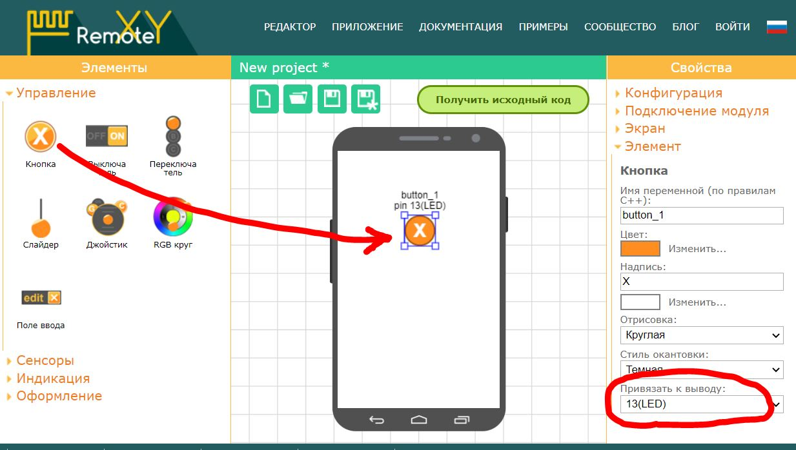

# Arduino UNO + Bluetooth HC-05

На этой странице вы найдете пошаговую инструкцию как запустить графический интерфейс на Arduino UNO используя модуль связи Bluetooth HC-05 или HC-06. Инструкция так же может быть использована для контроллеров Arduino Nano, Arduino Mini и совместимых.

> Примечание. Устройства iOS не поддерживают модули с классическим Bluetooth HC-05(06). Вместо них вы можете использовать модуль BLE HM-10.

## Шаг 1. Создайте графический интерфейс

Войдите в редактор [RemoteXY](https://remotexy.com/ru/editor/). Найдите на левой панели инструментов элемент **Кнопка**,   и переместите его в поле телефона. Выделите кнопку в поле телефона, что бы вокруг нее отобразилась рамка. Когда кнопка выделена, в правой панели свойств разверните вкладку **Элемент**. В свойстве элемента **Привязать к выводу** установите значение 13(LED).

> Примечание. Редактор позволяет указать вывод контроллера для некоторых элементов, которые могут однозначно определить состояние вывода, например "Включен "или "Отключен". Однако лучшим решением будет написание собственного кода управления выводами контроллера.

## Шаг 2. Настройте конфигурацию

Разверните вкладку **Конфигурация** на правой панели свойств. Кликните в любой элемент списка, откроется окно выбора конфигурации. Настройка конфигурации позволяет указать параметры вашей схемы. Выберите следующие параметры и нажмите кнопку **Применить**:

- Соединение: **Bluetooth**
- Контроллер: **Arduino UNO**
- Модуль: **HC-05 Bluetooth module**
- Среда: **Arduino IDE**

Вкладка Конфигурация должна выглядеть как на рисунке:

Разверните вкладку **Подключение модуля** и установите следующие значения настроек:

- Интерфейс подключения: Software Serial
- Контакт RX: 2
- Контакт TX: 3
- Скорость обмена: 9600

Настройки определяют, что модуль HC-05(06) подключается к Arduino через программный последовательный порт SoftwareSerial на скорости 9600 и используются контакты микроконтроллера 2 и 3 . 

> Скорость 9600 является скоростью обмена по умолчанию для модулей Bluetooth HC-05 и HC-06. Не выбирайте другую скорость.

## Шаг 3. Сформируйте скетч для Arduino

Нажмите кнопку **Получить исходный код**.

На открывшейся странице кликните ссылку **Загрузить код** и загрузите архив скетча. Распакуйте архив. В архиве размещен файл `project.ino`, откройте его в Arduino IDE.

Для компиляции скетча в среду Arduino IDE необходимо добавить библиотеку [RemoteXY](https://remotexy.com/ru/library/). Пройдите по ссылке загрузки библиотеки и следуйте инструкциям по ее установке.

В среде разработки выберите плату **Arduino UNO** и попробуйте скомпилировать скетч. Если вы все сделали правильно, скетч должен компилироваться без ошибок.

## Шаг 4. Подключите HC-05 к Arduino Uno

Подключите модуль Bluetooth HC-05 или HC-06 к Arduino Uno по схеме приведенной на рисунке. Обратите внимание, что контакт 2 платы Arduino выбранный как RX  соединяется с контактом TX модуля Bluetooth, а контакт 3 платы Arduino выбранный как TX с контактом RX модуля Bluetooth.

## Шаг 5. Загрузите скетч в Arduino.

Загрузите скетч в контроллер стандартным способом. Подсоедините контроллер Arduino UNO к компьютеру, выберите COM порт к которому подключилась плата и нажмите кнопку загрузки. 

## Шаг 6. Подключитесь с мобильного приложения.

Установите [мобильное приложение RemoteXY](https://remotexy.com/ru/download/) на ваш телефон.

Запустите приложение и нажмите кнопку **+** (Плюс) на верхней панели справа. В открывшемся окне выберите подключение Bluetooth. 

Если на вашем телефоне отключен Bluetooth, то включите его. Нажмите кнопку обновления списка доступных устройств в правом верхнем углу. Модуль Bluetooth HC-05 (HC-06) может иметь одно из следующих имен: «HC-05», «HC-06», «INVOR». Выберите его. Откроется окно для ввода пароля спаривания Bluetooth устройств. Пароль по умолчанию для HC-05 (HC-06) может быть 1234 или 0000. Введите пароль. 

После ввода пароля начнется подключение. Если вы все сделали правильно ту у вас должен отобразиться графический интерфейс с кнопкой, точно такой же как вы его разработали.  Попробуйте нажимать кнопку. При удерживании кнопки нажатой должен загораться светодиод LED на плате Arduino UNO.

> Примечание: В приложении для iOS необходимо включить Bluetooth используя системные настройки.

## Если не подключается...

Если подключение не удалось, проверьте себя по списку ниже. Это поможет вам найти ошибку. 

### Модуль не отображается в списке устройств

Если вы не видите вашего модуля в списке доступных устройств, попробуйте повторно нажать на кнопку обновления списка устройств спустя несколько секунд. Если модуль так и не появился, возможны следующие причины:

- Вы не включили Bluetooth на вашем телефоне.
- На модуль Bluetooth не подается питание. Возможно питание подключено не верно.
- Модуль Bluetooth  неисправен.

### Bluetooth устройство не найдено

Если вы видите ошибку `Bluetooth device not found`  или `Bluetooth device connection error` это означает что телефон не смог обнаружить модуль Bluetooth или не смог с ним соединиться. Возможны следующие причины:

- При подключении в приложении выбрано не то Bluetooth устройство. Например вы выбрали наушники или телефон вашего друга у которого включен Bluetooth.
- При подключении в приложении был введен не верный пароль для спаривания устройств. 

### Устройство не отвечает

Если вы видите ошибку `Board not reply` это означает что приложение подключилось к модулю Bluetooth но не может производить обмен данными с контроллером. Возможны следующие причины:

- Контакты RX и TX модуля Bluetooth подключены не верно, возможно они перепутаны местами. Проверьте по схеме на шаге 4.
- Контакты RX и TX модуля Bluetooth или один из них не подключены к контроллеру, плохой контакт;
- Не верно указаны настройки конфигурации или настройки подключения перед формированием исходного кода. Проверьте на шаге 2.
- Скорость передачи данных Bluetooth модуля не соответствует выбранной в настройке конфигурации. Проверьте на шаге 2.
- Вы внесли недопустимые изменения в скетч, например откорректировали структуру RemoteXY или массив RemoteXY_CONF, удалили вызовы функций RemoteXY_Init() или RemoteXY_Handler(). Сформируйте исходный код заново и загрузите его в контроллер без каких либо изменений.
- Использована старая версия библиотеки RemoteXY. Обновите версию библиотеки до последней.
- В Arduino не был загружен скетч, или был загружен другой скетч. Проверьте что вы загрузили именно нужный скетч.
- Контроллер Arduino не включен или неисправен. 

