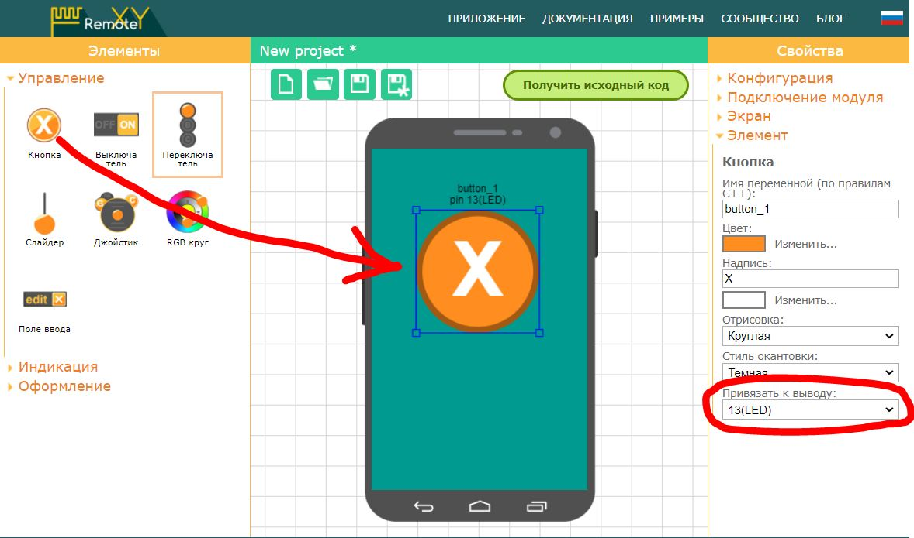
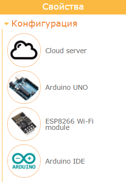
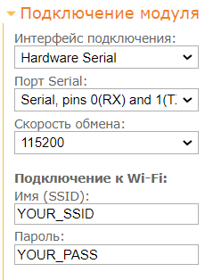
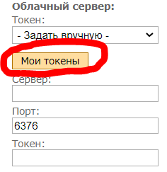
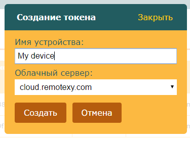
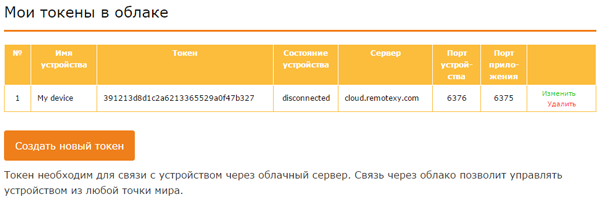
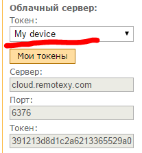
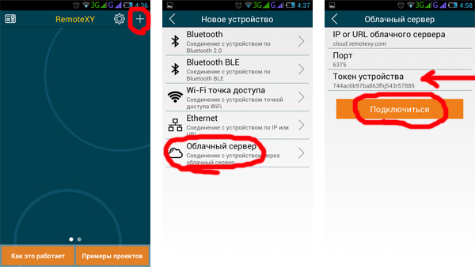

# Arduino UNO + ESP8266 через облачный сервер

На этой странице вы найдете пошаговую инструкцию как запустить графический интерфейс RemoteXY через облачный сервер используя Arduino UNO и модуль ESP8266, подключенный к аппаратному последовательному порту. ESP8266 будет сконфигурирован для подключения к вашей домашней WiFi сети с доступом в интернет. Инструкция так же может быть использована для контроллеров Arduino Nano, Arduino Mini и совместимых с внешним модулем ESP8266.

> Примечание. Подключение через облачный сервер позволяет подключаться к вашему устройству из любой точки мира.

## Шаг 1. Создайте графический интерфейс

Войдите в редактор [RemoteXY](https://remotexy.com/ru/editor/). Найдите на левой панели инструментов элемент **Кнопка**,   и переместите его в поле телефона. Выделите кнопку в поле телефона, что бы вокруг нее отобразилась рамка. Когда кнопка выделена, в правой панели свойств разверните вкладку **Элемент**. В свойстве элемента **Привязать к выводу** установите значение **13(LED)**.



> Примечание. Редактор позволяет указать вывод контроллера для некоторых элементов, которые могут однозначно определить состояние вывода, например **Включен** или **Отключен**. Однако лучшим решением будет написание собственного кода управления выводами контроллера.

## Шаг 2. Настройте конфигурацию

Разверните вкладку **Конфигурация** на правой панели свойств. Кликните в любой элемент списка, откроется окно выбора конфигурации. Настройка конфигурации позволяет указать параметры вашей схемы. Выберите следующие параметры и нажмите кнопку **Применить**:

- Соединение: **Cloud server**
- Контроллер: **Arduino UNO**
- Модуль: **ESP8266 WiFi module**
- Среда: **Arduino IDE**

Вкладка Конфигурация должна выглядеть как на рисунке:



Разверните вкладку **Подключение модуля** и установите следующие значения настроек:

- Интерфейс подключения: Hardware Serial
- Порт Serial: Serial, pins 0(RX) and 1(TX)
- Скорость обмена: 115200
- Имя (SSID): имя вашей домашней сети WiFi
- Пароль: пароль вашей домашней сети WiFi



Настройки указывают, что ESP8266 подключается к Arduino через аппаратный Serial (контакты 0 и 1) на скорости 115200. В настройках так же указано имя вашей домашней точки доступа WiFi и пароль. Через эту точку доступа модуль должен будет подключиться к интернет.

> Примечание. Модуль ESP8266 по умолчанию настроен на скорость подключения 115200. Именно по этой причине для связи необходимо использовать аппаратный Serial. Программный Serial не может работать на такой скорости.

## Шаг 3. Сформируйте токен устройства

В той же вкладке  **Подключение модуля** нажмите кнопку **Мои токены**, вы перейдете на соответствующую страницу, на которой отображаются зарегистрированные токены. 



> Примечание. Что бы создать токен устройства на облачном сервере вам необходимо зарегистрироваться на сайте RemoteXY. Вы так же можете открыть список токенов в вашем аккаунте на сайте.

Нажмите кнопку **Создать новый токен**. В открывшемся окне введите любое имя токена и нажмите кнопку **Создать**. 



Новый токен должен появиться в списке токенов.



> Примечание: На каждое ваше устройство которое работает через облачный сервер необходимо создать отдельный токен. В списке токенов устройств в личном кабинете вы можете контролировать состояние вашего устройства — колонка **Состояние устройства**. Состояние может быть одно из трех:
>
> - *disconnected* – устройство не подключено к облачному серверу;
> - *connected* – устройство зарегистрировалось на облачном сервере и готово для подключения с мобильного приложения;
> - *used* — к устройству подключились с мобильного приложения.

Вернитесь в редактор, откройте ту же вкладку **Подключение модуля** и в поле **Токен** выберите только что созданный токен. Данные токена заполнятся в соответствующих полях ниже.



## Шаг 4. Сформируйте скетч для Arduino

Нажмите кнопку **Получить исходный код**.

На открывшейся странице кликните ссылку **Загрузить код** и загрузите архив скетча. Распакуйте архив. В архиве размещен файл `project.ino`, откройте его в Arduino IDE.

Для компиляции скетча в среду Arduino IDE необходимо добавить библиотеку [RemoteXY](https://remotexy.com/ru/library/). Пройдите по ссылке загрузки библиотеки и следуйте инструкциям по ее установке.

В среде разработки выберите плату **Arduino UNO** и попробуйте скомпилировать скетч. Если вы все сделали правильно, скетч должен компилироваться без ошибок.

## Шаг 5. Подключите ESP8266 к Arduino Uno

Подключите ESP8266 к Arduino Uno по схеме приведенной ниже. Обратите внимание, что контакт 0 платы Arduino выбранный как RX  соединяется с контактом TX модуля ESP8266 , а контакт 1 платы Arduino выбранный как TX с контактом RX модуля ESP8266 .

Так как уровни сигналов модуля ESP8266 составляют 3.3В а плата Arduino работает на 5В, необходимо использовать резистивный делитель напряжения для преобразования уровня выходного сигнала TX.


## Шаг 6. Загрузите скетч в Arduino.

Так как к основному Serial порту Arduino подключен модуль ESP8266, это будет мешать загрузке скетч. Перед загрузкой скетча необходимо отсоединить ESP8266 от контактов 0 и 1 платы Arduino. После отсоединения ESP8266 загрузите скетч в контроллер обычным способом. Подсоедините контроллер Arduino UNO к компьютеру, выберите COM порт к которому подключилась плата и нажмите кнопку загрузки. После загрузки скетча снова подсоедините контакты ESP8266.

> Внимание. Отключение и подключение ESP8266 производите только при отсутствии питания на контроллере.

> Примечание: Если вы все сделали правильно, вы увидите мерцание голубого светодиода на модуле ESP8266 в течении около половины секунды сразу после старта Arduino . Если это произошло, то скорее всего обмен данными между Arduino и ESP8266 установлен. В течении этого времени RemoteXY производит настройку ESP8266 для подключения к сети WiFi, и при обмене данными светодиод мерцает.

## Шаг 7. Подключитесь с мобильного приложения.

Установите [мобильное приложение RemoteXY](https://remotexy.com/ru/download/) на ваш телефон.

Запустите приложение и нажмите кнопку **+** (Плюс) на верхней панели справа. В открывшемся окне выберите подключение **Облачный сервер**. 

В открывшемся окне в поле **Токен устройства** введите ваш токен, который вы создали на шаге 3. Обратите внимание, что ввести необходимо не имя устройства, а буквенно-цифровое обозначение токена.

Нажмите кнопку **Подключиться**. Если вы все сделали правильно, то далее должен открыться графический интерфейс.



## Если не подключается...

Если подключение не удалось, проверьте себя по списку ниже. Это поможет вам найти ошибку. 

Проверьте, подключилась ли Arduino к облачному серверу. Для этого в своем аккаунте на сайте RemoteXY зайдите в раздел **Мои токены**. Посмотрите что указано в колонке **Состояние устройства** на против используемого токена. Если устройство подключилось к облачному серверу, значение должно быть **Connected**. Попробуйте обновить страницу. Имейте ввиду, что время между стартом устройства и подключением к облачному серверу может составлять до одной минуты.

##### Вы видите токен Connected

Устройство успешно подключилось к облачному серверу. Если мобильное приложение не подключается, возможны следующие ситуации:

- не верно введен токен в мобильном приложении. В этом случае вы увидите ошибку  о том что токен не зарегистрирован на облачном сервере. Проверьте что вы ввели буквенно-цифровое обозначение токена, а не его имя. Проверьте каждую букву.
- ваш телефон не имеет доступа в интернет;
- по каким то причинам нет доступа к cloud.remotexy.com, вы увидите ошибку об ошибочном HOST.
- проверьте что вы не изменили порт подключения к облачному серверу в приложении, порт должен быть 6375.

##### Вы видите токен Disconnected

Если устройство не подключилось к облачному серверу, ошибку необходимо искать в самом устройстве. 

Модуль ESP8266 управляется при помощи AT команд, которые посылает ему Arduino под управлением библиотеки RemoteXY. Вы можете увидеть посылаемые команды открыв Serial Monitor в среде разработки Arduino IDE. Это возможно потому, что ESP8266 и Serial Monitor подключены к одному порту. Вы сможете увидеть только отправляемые AT команды, однако ответы от ESP8266 вы не сможете видеть. Но и этого достаточно что бы провести диагностику системы.

Запустите Serial Monitor, установите скорость 115200. Если необходимо нажмите кнопку сброса на контроллере.

#### Serial Monitor ничего не показывает

Если Serial Monitor не выводит никаких сообщений, это скорее всего означает, что Arduino не выполнят вашу программу или вы не верно настроили способ связи на шаге 2. Даже если у вас не подключен ESP8266, правильно сконфигурированная библиотека RemoteXY все равно отправляет запросы к модулю, пытаясь его обнаружить, и вы бы увидели это в Serial Monitor. Если Serial Monitor не выводит никаких сообщений, то возможны следующие неисправности:

- Не верно сконфигурирована схема подключения и способ связи на шаге 2.
- Внесены недопустимые изменения в код, например откорректирована структура RemoteXY или массив RemoteXY_CONF, удалены вызовы функций RemoteXY_Init() или RemoteXY_Handler(). Для проверки используйте только автоматически сформированный код, без каких либо изменений.
- Serial Monitor не подключился к Arduino. Возможно вы не выбрали скорость 115200 после того как запустили Serial Monitor.
- Нужный скетч не был загружен в Arduino.
- Ваша Arduino не включена или неисправна.

#### Serial Monitor выводит запросы AT команд

Если Serial Monitor выводит некоторые команды, то анализируя эти команды можно проверить следующие ошибки.

##### ESP8266 не отвечает

Если вы видите только команды AT и больше ничего:

```
AT
AT
AT
AT
```

Это означает, что модуль ESP8266 не отвечает на команды. Проблема может быть или в неверном подключении модуля или в нем самом. Возможны следующие причины:

- Контакты RX и TX подключены не верно, перепутаны контакты, или подключены не к тем контактам, или не подключены совсем.
- Скорость передачи данных не совпадает, ESP8266 по умолчанию использует скорость 115200. Возможно ESP8266 был вручную сконфигурирован для работы на другой скорости.
- Нет питания на ESP8266, при подаче питания на ESP8266 должен светиться красный светодиод;
- Не хватает мощности источника питания 3.3 В для ESP8266. На разных платах совместимых с Arduino могут быть установлены разные 3.3 В DC-DC преобразователи с разным максимальным выходным током.
- Модуль ESP8266 имеет прошивку в которой нет поддержки AT команд.
- Модуль ESP8266 неисправен.

##### Не все AT команды обрабатываются

Если после команды AT следует последовательность команд, то модуль ESP8266 на связи с Arduino. Ниже приведена правильная последовательность команд. 

```
AT
AT+RST
ATE0
AT+CWMODE=1
AT+CWQAP
AT+CWDHCP=1,1
AT+CWJAP="MySSID","MyPassword"
AT+CIPMODE=0
AT+CIPMUX=1
AT+CIPSTART=0,"TCP","cloud.remotexy.com",6376
AT+CIPSEND=0,44
UxxxxxxxxxxxxxxxxxxxxxxxxxxxxxxxxxxxxxxAT+CIPSEND=0,6
Uxxxxxx 
```

Но на какой то команде связь может обрываться.  Это поможет найти ошибку.

Если последней командой которую вы видите является  `AT+CWJAP="MySSID","MyPassword"`, это означает что модуль ESP8266 не может подключиться к домашней сети WiFi с указанным именем и паролем. Проверьте что точка доступа работает и ее имя и пароль указаны верно.

Если последней командой является  `AT+CIPSTART=0,"TCP","cloud.remotexy.com",6376` и далее она может повторяться с некоторой периодичностью, это означает что нет доступа  облачному серверу cloud.remotexy.com. Проверьте что у вашей точки доступа есть интернет.

Если вы видите команду  `AT+CIPSEND=0,44` и далее через какое то время снова повторяется команда   `AT+CIPSTART=0,"TCP","cloud.remotexy.com",6376` это означает, что сервер доступен, но токен был отклонен сервером, как незарегистрированный.

Если обрыв происходит на любой другой строчке, скорее всего не хватает мощности источника питания 3.3 В для ESP8266.

##### Все AT команды обрабатываются но не подключается

Если выводится вся последовательность AT команд из предыдущего пункта, но при подключении приложение выводит ошибку, то возможны следующие варианты. 

- Не хватает мощности источника питания 3.3 В для ESP8266.
- ESP8266 имеет устаревшую прошивку.
- Размер памяти ESP8266 составляет 4 Mbit и меньше, и актуальная прошивка не может быть прошита.

> Примечание. В приложении Android имеется возможность проанализировать лог подключения, это так же может помочь идентифицировать ошибку.

