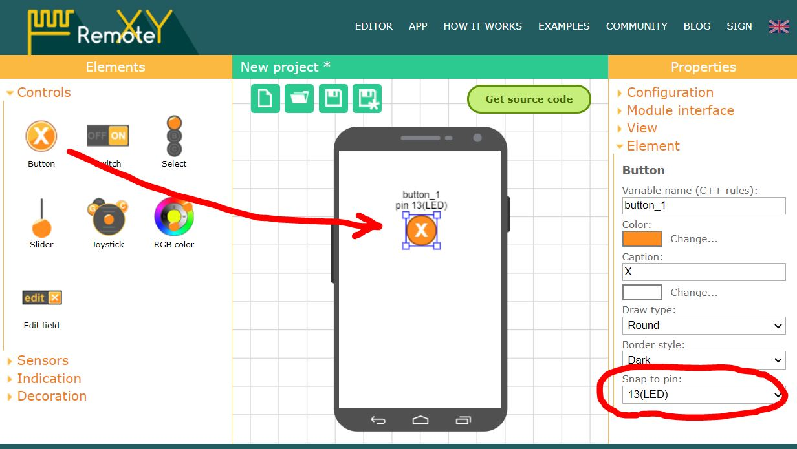
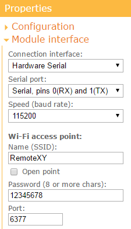
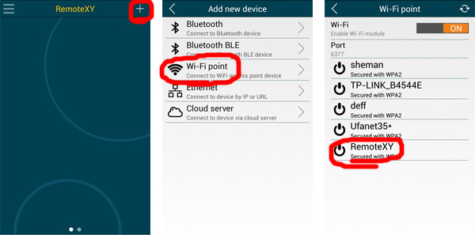

# Arduino UNO + external ESP8266 as WiFi access point

This step-by-step tutorial will show you how to launch the RemoteXY graphical interface on Arduino UNO board with external ESP8266 module connected to the hardware serial port. The ESP8266 will be configured as an access point. This tutorial can also be used for Arduino Nano, Arduino Mini, Arduino Meaga and other boards.

## Step 1. Create Graphical interface

Go to [RemoteXY editor](https://remotexy.com/ru/editor/). Find the **Button** element on the left toolbar. Drag it to the phone screen. Select the **button**, you will see a frame around it. With the button selected, in the right toolbar, open the **Element** tab. Find **Snap to pin** setting and select **13(LED)** value.



> Note. The editor allows you to specify pin for some elements that can uniquely determine the state of the pin, such as high or low level. However, the best solution would be to write your own code to control the controller pins.

## Step 2. Configure project

Open the **Configuration** tab on the right toolbar. Click on any item in the list, the configuration settings window will open. The configuration setting allows you to specify the options for your board and the connection method. Select the following settings and click the **Apply** button:

- Connection: **WiFi access point**
- Board: **Arduino UNO**
- Module: **ESP8266 WiFi module**
- IDE: **Arduino IDE**

The configuration tab should look like the picture:


Open the **Module interface** tab and set the following settings values:

- Connection interface: Hardware Serial
- Serial port: Serial, pins 0(RX) and 1(TX)
- Speed (baud rate): 115200
- Name (SSID): RemoteXY
- Password: 12345678
- Port: 6377



The settings determine that the ESP8266 module connects to the Arduino through the Hardware Serial at 115200 and uses pins 0 and 1.  The settings also specify the access point name (SSID) and password for the access point you want to open.

> Note. The ESP8266 is configured with a default baud rate of 115200. For this reason, you need to use Hardware Serial for communication. Software Serial cannot run at this speed.

## Step 3. Get the source code for Arduino

Press **Get source code** button.

On the page that opens, click the **Download code** link and download the archive of the sketch for Arduino IDE. Unpack this archive. The archive contains a file `project.ino`, open it in Arduino IDE.

To compile the sketch, you need to add the [RemoteXY library](https://remotexy.com/ru/library/) to the Arduino IDE. Go to the download link for the library and follow the tutorial to install it.

In the Arduino IDE settings, select the **Arduino UNO** board and try compiling the sketch. If you did everything correctly, the sketch should compile without errors.

## Step 4. Connect ESP8266 to Arduino Uno

Connect ESP8266 to Arduino Uno according to the diagram below. Note that pin 0 of the Arduino board selected as RX connects to the TX pin of the Bluetooth module, and pin 1 of the Arduino board selected as TX connects to the RX pin of the ESP8266 module.

The signal levels of the ESP8266 module are 3.3V but the Arduino board runs at 5V, you need to use a resistive voltage divider to convert the TX output signal level. 

> Note. Some ESP8266 modules are tolerant to the TX signal level and you may not need to use the voltage converter if your module turns out to be like that.


## Step 5. Upload the sketch to Arduino board.

Since the ESP8266 module is connected to the main Serial port of the Arduino board, this will interfere with the download of the sketch. Before uploading the sketch, you need to disconnect the ESP8266 from pins 0 and 1 of the Arduino board. After disconnecting the ESP8266, upload the sketch to the board in the usual way. Connect the Arduino UNO board to your computer, select the COM port to which the board is connected and click the download button. After uploading the sketch, connect the pins of the ESP8266.

> Attention. Disconnect and connect the ESP8266 only when there is no power to the board.

If you did everything correctly, then immediately after starting the Arduino you will see a blinking blue LED on the ESP8266 module for about half a second. If this happens, then most likely the data exchange between the Arduino board and the ESP8266 is established. During this time, RemoteXY configures the ESP8266 to work as an access point using AT commands, and the LED blinks during data exchange.

## Step 6. Connect to the board using the mobile app.

Install the [RemoteXY mobile app](https://remotexy.com/ru/download/) to your phone.

Launch the application and click the **+** (Plus) button on the top navigation bar. In the window that opens, select a Bluetooth connection.

> Attention. In accordance with the private security policy, the application will ask you for location permission. The app requires location permission to search for WiFi devices and connect to them.

#### Android app

In Android app, click the refresh button on the top navigation bar. You will see all available WiFi points. Find the point named **RemoteXY** and  click it. In the password entry window that opens, enter the password **12345678**, which we specified in step 2. If you did everything correctly, the graphical interface should open.



#### iOS app

In the iOS application, before connecting, you must manually connect the smartphone to the access point using the system settings. Go to system settings and connect to the **RemoteXY** access point with the password **12345678** , which we specified in step 2. Then go back to the RemoteXY app, you should see the name of the connected access point. Then click the **Connect** button.  If you did everything correctly, the graphical interface should open.


## If not connecting...

If the connection fails, check yourself against the list below. This will help you find the error.

The Arduino board under the control of the RemoteXY library sends commands to the ESP8266 module. You can see these commands if you open the Serial Monitor in the Arduino IDE. This is possible because ESP8266 and Serial Monitor are connected to the same port. You will only be able to see the output AT commands, but you will not be able to see the responses from the ESP8266. But this is enough to diagnose the system.

Run Serial Monitor, set the baud rate to 115200. If necessary, press the reset button on the board.

#### Serial Monitor shows nothing

If the Serial Monitor does not display any messages, it most likely means that the Arduino will not execute your program or you did not configure the communication method correctly in step 2. Even if you don't have an ESP8266 connected, a properly configured RemoteXY library still sends requests to the module, trying to detect it, and you would see this in the Serial Monitor. If the Serial Monitor does not display any messages, then the following malfunctions are possible:

- The configuration settings or module interface settings were not specified correctly before you get the source code. Check in step 2.
- You made invalid changes to the sketch, such as correcting the `RemoteXY` structure or the `RemoteXY_CONF` array, removing calls to `RemoteXY_Init ()` or `RemoteXY_Handler ()` functions. Rebuild the source code and upload it into the board without any changes.
- Serial Monitor didn't connect to Arduino board. Perhaps you did not select 115200 baud after starting Serial Monitor.
- No sketch has been loaded into the Arduino board, or another sketch has been loaded. Make sure you have uploaded the exact sketch you want.
- Arduino board not powered on or defective.

#### Serial Monitor displays AT command requests

If Serial Monitor displays some commands, then analyzing these commands, you can check the following errors.

##### ESP8266 not responding

If you only see AT commands and nothing else:

```
AT
AT
AT
AT
```

This means that the ESP8266 module is not responding to commands. The problem may be either in the wrong connection of the module or in itself. Possible reasons are as follows:

- The RX and TX pins of the Bluetooth module are not connected correctly, they may be reversed. Check with the diagram in step 4.
- The baud rate does not match, the ESP8266 defaults to 115200. The ESP8266 may have been manually configured to operate at a different baud rate.
- There is no power on the ESP8266, when the power is applied to the ESP8266, the red LED should be on.
- Not enough 3.3V power supply capacity for ESP8266. Different Arduino compatible boards can have different 3.3V DC-DC converters with different maximum output current.
- The ESP8266 module has firmware that does not support AT commands.
- ESP8266 module is defective.

##### Not all AT commands are processed

If the AT command is followed by a sequence of commands, it means the ESP8266 module is in communication with the Arduino board. The following is the correct sequence of commands:

```
AT
AT+RST
ATE0
AT+CWMODE=2
AT+CWDHCP=0,1
AT+CWSAP="RemoteXY","12345678",10,4
AT+CIPMODE=0
AT+CIPMUX=1
AT+CIPSERVER=1,6377
```

But after some commands, the connection may be broken. This will help you find the error.

If there is no last line with the command  `AT+CIPSERVER=1,6377`, this may indicate that the ESP8266 module has old firmware.

If the last command you see is `AT + RST`, it means that the ESP8266 module does not start after the reset, after it is loaded there is no response` ready`.

If the break occurs on any other line, it is most likely that there is not enough power from the 3.3V power supply for the ESP8266.

##### All AT commands are processed but not connected

If the entire sequence of AT commands from the previous list is displayed, but the application displays an error message, look at which error the application is showing and try to fix it. The following options are also possible:

- Not enough 3.3V power supply capacity for ESP8266.
- ESP8266 module has old firmware.
- ESP8266 memory size is 4 Mbit or less, and the current firmware cannot be flashed.

> Note. The Android application has the ability to analyze the connection log, this can also help identify the error.

