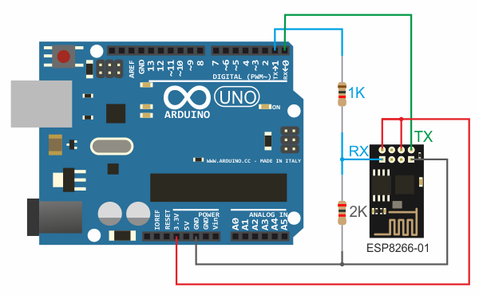

# Arduino UNO + внешний ESP8266 как WiFi точка доступа

Эта пошаговая инструкция поможет вам запустить графический интерфейс RemoteXY на контроллере Arduino UNO используя модуль ESP8266, подключенный к аппаратному последовательному порту. ESP8266 будет сконфигурирован как точка доступа. Инструкция так же может быть использована для контроллеров Arduino Nano, Arduino Mini и совместимых с подключенным внешним модулем ESP8266.

## Шаг 1. Создайте графический интерфейс

Войдите в [редактор RemoteXY](https://remotexy.com/ru/editor/). Найдите на левой панели инструментов элемент **Кнопка**,   и переместите его в поле телефона. Выделите кнопку в поле телефона, что бы вокруг нее отобразилась рамка. Когда кнопка выделена, в правой панели свойств разверните вкладку **Элемент**. В свойстве элемента **Привязать к выводу** установите значение 13(LED).


> Примечание. Редактор позволяет указать вывод контроллера для некоторых элементов, которые могут однозначно определить состояние вывода, например **Включен** или **Отключен**. Однако лучшим решением будет написание собственного кода управления выводами контроллера.

## Шаг 2. Настройте конфигурацию

Разверните вкладку **Конфигурация** на правой панели свойств. Кликните в любой элемент списка, откроется окно выбора конфигурации. Настройка конфигурации позволяет указать параметры вашей схемы. Выберите следующие параметры и нажмите кнопку **Применить**:

- Соединение: **WiFi access point**
- Контроллер: **Arduino UNO**
- Модуль: **ESP8266 WiFi module**
- Среда: **Arduino IDE**

Вкладка Конфигурация должна выглядеть как на рисунке:


Разверните вкладку **Подключение модуля** и установите следующие значения настроек:

- Интерфейс подключения: Hardware Serial
- Порт Serial: Serial, pins 0(RX) and 1(TX)
- Скорость обмена: 115200
- Имя (SSID): RemoteXY
- Пароль: 12345678
- Порт: 6377


Настройки указывают, что ESP8266 подключается к Arduino через аппаратный Serial (контакты 0 и 1) на скорости 115200. В настройках так же указано имя точки доступа SSID и пароль точки доступа которую необходимо создать.

> Примечание. Модуль ESP8266 по умолчанию настроен на скорость подключения 115200. Именно по этой причине для связи необходимо использовать аппаратный Serial. Программный Serial не может работать на такой скорости.

## Шаг 3. Сформируйте скетч для Arduino

Нажмите кнопку **Получить исходный код**.

На открывшейся странице кликните ссылку **Загрузить код** и загрузите архив скетча. Распакуйте архив. В архиве размещен файл `project.ino`, откройте его в Arduino IDE.

Для компиляции скетча в среду Arduino IDE необходимо добавить [библиотеку RemoteXY](https://remotexy.com/ru/library/). Пройдите по ссылке загрузки библиотеки и следуйте инструкциям по ее установке.

В среде разработки выберите плату **Arduino UNO** и попробуйте скомпилировать скетч. Если вы все сделали правильно, скетч должен компилироваться без ошибок.

## Шаг 4. Подключите ESP8266 к Arduino Uno

Подключите ESP8266 к Arduino Uno по схеме приведенной ниже. Обратите внимание, что контакт 0 платы Arduino выбранный как RX  соединяется с контактом TX модуля ESP8266 , а контакт 1 платы Arduino выбранный как TX с контактом RX модуля ESP8266 .

Так как уровни сигналов модуля ESP8266 составляют 3.3В а плата Arduino работает на 5В, необходимо использовать резистивный делитель напряжения для преобразования уровня выходного сигнала TX.

> Примечание. Некоторые модули ESP8266 толерантны к уровню сигнала TX и вы можете не использовать конвертер напряжения если ваш модуль оказался таким.



## Шаг 5. Загрузите скетч в Arduino.

Так как модуль ESP8266 подключен к основному последовательному порту платы Arduino, это будет мешать загрузке скетча. Перед загрузкой скетча необходимо отсоединить ESP8266 от контактов 0 и 1 платы Arduino. После отсоединения ESP8266 загрузите скетч в контроллер обычным способом. Подсоедините контроллер Arduino UNO к компьютеру, выберите COM порт к которому подключилась плата и нажмите кнопку загрузки. После загрузки скетча снова подсоедините контакты ESP8266.

> Внимание. Отключение и подключение ESP8266 производите только при отсутствии питания на контроллере.

Если вы все сделали правильно, вы увидите мерцание голубого светодиода на модуле ESP8266 в течении около половины секунды сразу после старта Arduino . Если это произошло, то скорее всего обмен данными между Arduino и ESP8266 установлен. В течении этого времени RemoteXY производит настройку ESP8266 при помощи AT-команд для работы модуля в качестве точки доступа, и при обмене данными светодиод мерцает.

## Шаг 6. Подключитесь с мобильного приложения.

Установите [мобильное приложение RemoteXY](https://remotexy.com/ru/download/) на ваш телефон.

Запустите приложение и нажмите кнопку **+** (Плюс) на верхней панели справа. В открывшемся окне выберите подключение **WiFi Point.** 

> Внимание. В соответствии с приватной политикой безопасности, приложение попросит у вас разрешение на определение местоположения. Для поиска WiFi устройств и подключения к ним приложению требуется разрешение на местоположение. 

#### В приложении для Android

В приложении для Android нажмите кнопку поиска устройств в правом углу панели инструментов. У вас отобразятся все доступные точки WiFi. Найдите точку с именем **RemoteXY** и выберите ее. В открывшемся окне ввода пароля введите пароль **12345678**, который мы указали на шаге 2. Если вы все сделали правильно, то далее должен открыться графический интерфейс.


#### В приложении для iOS

В приложении для iOS перед подключением необходимо вручную подключить смартфон к точке доступа, используя системные настройки операционной системы. Зайдите в системные настройки и подключитесь к точке доступа **RemoteXY** с паролем **12345678**, который мы указали на шаге 2. Затем вернитесь в приложение RemoteXY, вы должны увидеть имя подключенной точки доступа. Далее нажмите кнопку **Connect**.  Если вы все сделали правильно, то далее должен открыться графический интерфейс.


## Если не подключается...

Если подключение не удалось, проверьте себя по списку ниже. Это поможет вам найти ошибку. 

Модуль ESP8266 управляется при помощи AT команд, которые посылает ему Arduino под управлением библиотеки RemoteXY. Вы можете увидеть посылаемые команды открыв Serial Monitor в среде разработки Arduino IDE. Это возможно потому, что ESP8266 и Serial Monitor подключены к одному порту. Вы сможете увидеть только отправляемые AT команды, однако ответы от ESP8266 вы не сможете видеть. Но и этого достаточно что бы провести диагностику системы.

Запустите Serial Monitor, установите скорость 115200. Если необходимо нажмите кнопку сброса на контроллере.

#### Serial Monitor ничего не показывает

Если Serial Monitor не выводит никаких сообщений, это скорее всего означает, что Arduino не выполнят вашу программу или вы не верно настроили способ связи на шаге 2. Даже если у вас не подключен ESP8266, правильно сконфигурированная библиотека RemoteXY все равно отправляет запросы к модулю, пытаясь его обнаружить, и вы бы увидели это в Serial Monitor. Если Serial Monitor не выводит никаких сообщений, то возможны следующие неисправности:

- Не верно сконфигурирована схема подключения и способ связи на шаге 2.
- Внесены недопустимые изменения в код, например откорректирована структура RemoteXY или массив RemoteXY_CONF, удалены вызовы функций RemoteXY_Init() или RemoteXY_Handler(). Для проверки используйте только автоматически сформированный код, без каких либо изменений.
- Serial Monitor не подключился к Arduino. Возможно вы не выбрали скорость 115200 после того как запустили Serial Monitor.
- Нужный скетч не был загружен в Arduino.
- Ваша Arduino не включена или неисправна.

#### Serial Monitor выводит запросы AT команд

Если Serial Monitor выводит некоторые команды, то анализируя эти команды можно проверить следующие ошибки.

##### ESP8266 не отвечает

Если вы видите только команды AT и больше ничего:

```
AT
AT
AT
AT
```

Это означает, что модуль ESP8266 не отвечает на команды. Проблема может быть или в неверном подключении модуля или в нем самом. Возможны следующие причины:

- Контакты RX и TX подключены не верно, перепутаны контакты, или подключены не к тем контактам, или не подключены совсем. Проверьте по схеме на шаге 4.
- Скорость передачи данных не совпадает, ESP8266 по умолчанию использует скорость 115200. Возможно ESP8266 был вручную сконфигурирован для работы на другой скорости.
- Нет питания на ESP8266, при подаче питания на ESP8266 должен светиться красный светодиод.
- Не хватает мощности источника питания 3.3 В для ESP8266. На разных платах совместимых с Arduino могут быть установлены разные 3.3 В DC-DC преобразователи с разным максимальным выходным током.
- Модуль ESP8266 имеет прошивку в которой нет поддержки AT команд.
- Модуль ESP8266 неисправен.

##### Не все AT команды обрабатываются

Если после команды AT следует последовательность команд, то модуль ESP8266 на связи с Arduino. Ниже приведена правильная последовательность команд. 

```
AT
AT+RST
ATE0
AT+CWMODE=2
AT+CWDHCP=0,1
AT+CWSAP="RemoteXY","12345678",10,4
AT+CIPMODE=0
AT+CIPMUX=1
AT+CIPSERVER=1,6377
```

Но на какой то команде связь может обрываться.  Это поможет найти ошибку.

Если нет последней строчки с командой  `AT+CIPSERVER=1,6377`, это может говорить о том, что модуль ESP8266 имеет устаревшую прошивку. 

Если последняя команда которую вы видите есть `AT+RST`, это означает что модуль ESP8266 не запускается после сброса, после его загрузки нет ответа `ready`.

Если обрыв происходит на любой другой строчке, скорее всего не хватает мощности источника питания 3.3 В для ESP8266.

##### Все AT команды обрабатываются но не подключается

Если выводится вся последовательность AT команд из предыдущего пункта, но при подключении приложение выводит ошибку, посмотрите какую именно ошибку показывает приложение и попробуйте ее исправить. Так же возможны следующие варианты. 

- Не хватает мощности источника питания 3.3 В для ESP8266.
- ESP8266 имеет устаревшую прошивку.
- Размер памяти ESP8266 составляет 4 Mbit и меньше, и актуальная прошивка не может быть прошита.

> Примечание. В приложении Android имеется возможность проанализировать лог подключения, это так же может помочь идентифицировать ошибку.

