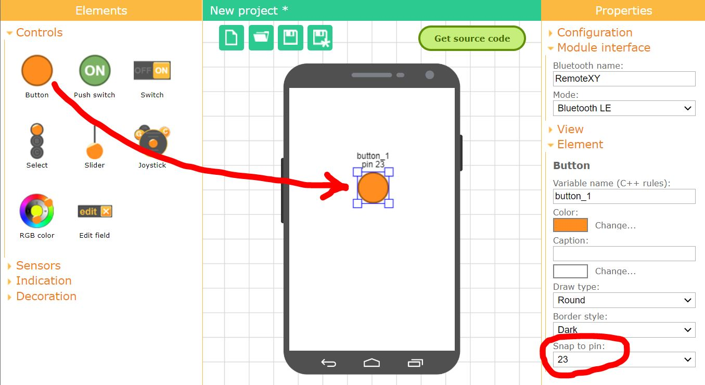
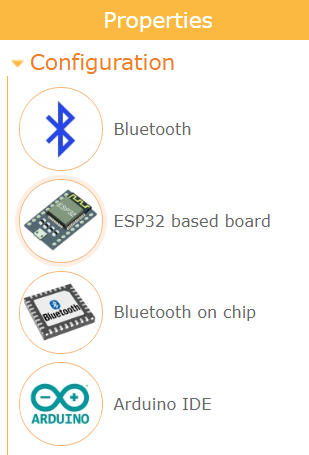
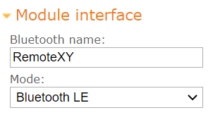
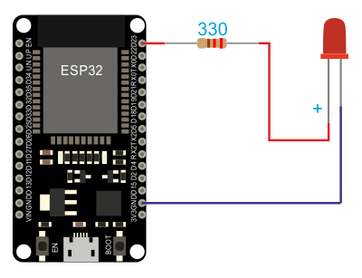
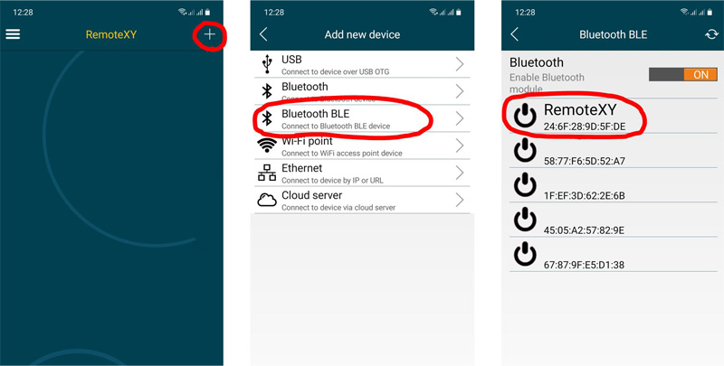

# ESP32 Bluetooth LE

This step-by-step tutorial will show you how to launch the RemoteXY graphical interface on the ESP32 board using built-in Bluetooth communication module. This tutorial can also be used for various ESP32 compatible controllers.

## Step 1. Create Graphical interface

Go to [RemoteXY editor](https://remotexy.com/ru/editor/). Find the **Button** element on the left toolbar. Drag it to the phone screen. Select the **button**, you will see a frame around it. With the button selected, in the right toolbar, open the **Element** tab. Find **Snap to pin** setting and select **23** value. Selecting a pin number will generate an additional code that redirects the button state to this pin. If an LED is connected to this pin, it will light up when a button is pressed in the GUI. Perhaps your board has a built-in LED, then select the pin to which the built-in LED is connected.

> Note. The editor allows you to specify pin for some elements that can uniquely determine the state of the pin, such as high or low level. However, the best solution would be to write your own code to control the controller pins.

## Step 2. Configure project

Open the **Configuration** tab on the right toolbar. Click on any item in the list, the configuration settings window will open. The configuration setting allows you to specify the options for your board and the connection method. Select the following settings and click the **Apply** button:

- Connection: **Bluetooth**
- Board: **ESP32 based board**
- Module: **Bluetooth on chip**
- IDE: **Arduino IDE**

The configuration tab should look like the picture:

Open the **Module interface** tab and set the following settings values:

- Bluetooth name: RemoteXY
- Mode: Bluetooth LE

The settings define the name of the Bluetooth device, how the phone will see it, as well as the operating mode: **Bluetooth LE** or **Classic Bluetooth**. 

> Note. You can select the Classic Bluetooth operating mode. iOS devices do not support this mode.

## Step 3. Get the source code for ESP32

Press **Get source code** button.

On the page that opens, click the **Download code** link and download the archive of the sketch for Arduino IDE. Unpack this archive. The archive contains a file `project.ino`, open it in Arduino IDE.

To compile the sketch, you need to add the [RemoteXY library](https://remotexy.com/ru/library/) to the Arduino IDE. Go to the download link for the library and follow the tutorial to install it.

In the Arduino IDE settings, select the board for which you are compiling the sketch, for example select **ESP32 Dev Module** and try compiling the sketch. If you did everything correctly, the sketch should compile without errors.

Upload the sketch to the board in the usual way. Connect the ESP32 board to your computer, select the COM port to which the board is connected and click the download button.

## Step 4. Connect LED to ESP32

The LED will light up when you press a button in the GUI and allow you to test how it works.

If your board has an onboard LED and you selected the pin for that LED in step 1, then you don't need to do anything else.

If your board does not have a built-in LED, we recommend connecting the LED to pin 23 selected in step 1. Connect the LED through a 330 ohm current limiting resistor to pin 23 and GND.

## Step 5. Connect to the board using the mobile app.

Install the [RemoteXY mobile app](https://remotexy.com/ru/download/) to your phone.

Launch the application and click the **+** (Plus) button on the top navigation bar. In the window that opens, select a Bluetooth BLE connection.

If Bluetooth is disabled on your phone, turn it on. Click the refresh button on the top navigation bar to start searching the list of available devices. The device should appear in the list with the name RemoteXY as you set it in step 2. Click it.

If you did everything correctly, you should see a graphical interface with a button, exactly the same as you designed it on editor. Try click the button. Holding the button down should light up the LED.

> Note: In the iOS app, Bluetooth must be turned on using the system settings.

## If not connecting...

If the connection fails, check yourself against the list below. This will help you find the error.

### The module is not displayed in the device list of app

If you don't see your module in the list of available Bluetooth devices, try pressing the refresh button again to search for devices after a few seconds. If the module still does not appear, the following reasons are possible:

- You have not turned on Bluetooth on your phone.
- The sketch was not uploaded to the ESP32 board.
- In step 2, you specified a different Bluetooth name than RemoteXY. Find the device with the given name in the list.
- You may have entered the tab to search for classic Bluetooth devices, and the device in step 2 was configured as Bluetooth LE. Or vice versa.
- Sometimes it happens that the phone cannot determine the device name the first time. If there are other devices without a name in the list and yours does not appear, try clicking the refresh button again.
- ESP32 board defective.

### Bluetooth device found but not connecting

Modern versions of the Android OS strictly control the Bluetooth devices. If you have already tried to connect to your ESP32 controller via Bluetooth from any other application, the operating system will remember this and will not allow you to connect to this device from the RemoteXY application. To clear the memory of the operating system, you need to go to the Android system settings, then go to *Connections* -> *Bluetooth*. Find your device in the list of devices and perform the Unpair operation. After that, try to connect to the ESP32 again from the RemoteXY app.
