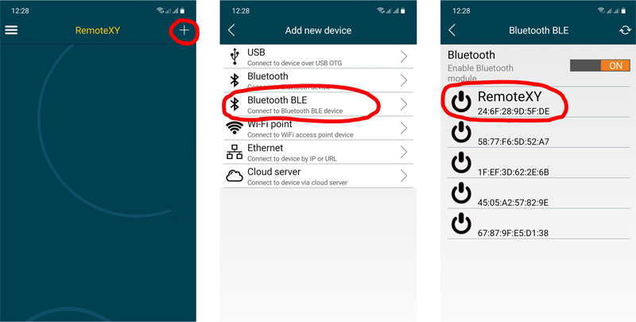

# ESP32 Bluetooth LE 

Эта пошаговая инструкция поможет вам запустить графический интерфейс RemoteXY на контроллере ESP32 используя интегрированную возможность связи Bluetooth LE. Инструкция подходит для любых контроллеров на базе ESP32 и совместимых.

## Шаг 1. Создайте графический интерфейс

Войдите в [редактор RemoteXY](https://remotexy.com/ru/editor/). Найдите на левой панели инструментов элемент **Кнопка**,   и переместите его в поле телефона. Выделите кнопку в поле телефона, что бы вокруг нее отобразилась рамка. Когда кнопка выделена, в правой панели свойств разверните вкладку **Элемент**. В свойстве элемента **Привязать к выводу** установите значение контакта 23. Выбор номера контакта приведет к формированию дополнительного кода перенаправляющего состояние кнопки на этот контакт. Если к этому контакту будет подключен светодиод, то он будет зажигаться при нажатии кнопки в графическом интерфейсе. Возможно в вашей плате есть встроенный светодиод, тогда выберите контакт к которому подключен встроенный светодиод.

> Примечание. Редактор позволяет указать вывод контроллера для некоторых элементов, которые могут однозначно определить состояние вывода, например "Включен "или "Отключен". Однако лучшим решением будет написание собственного кода управления выводами контроллера.

## Шаг 2. Настройте конфигурацию

Разверните вкладку **Конфигурация** на правой панели свойств. Кликните в любой элемент списка, откроется окно выбора конфигурации. Настройка конфигурации позволяет указать параметры вашей схемы. Выберите следующие параметры и нажмите кнопку **Применить**:

- Соединение: **Bluetooth**
- Контроллер: **ESP32 based board**
- Модуль: **Bluetooth on chip**
- Среда: **Arduino IDE**

Вкладка Конфигурация должна выглядеть как на рисунке:

Разверните вкладку **Подключение модуля** и установите следующие значения настроек:

- Имя Bluetooth: RemoteXY
- Mode: Bluetooth LE

Настройки определяют наименование Bluetooth устройства, как его будет видеть телефон а так же режим работы: **Bluetooth LE** или **Classic Bluetooth** . 

> Примечание. Вы можете выбрать режим работы Classic Bluetooth. iOS устройства не поддерживают этот режим. 

## Шаг 3. Сформируйте скетч для ESP32

Нажмите кнопку **Получить исходный код**.

На открывшейся странице кликните ссылку **Загрузить код** и загрузите архив скетча. Распакуйте архив. В архиве размещен файл `project.ino`, откройте его в Arduino IDE.

Для компиляции скетча в среду Arduino IDE необходимо добавить [библиотеку RemoteXY](https://remotexy.com/ru/library/). Пройдите по ссылке загрузки библиотеки и следуйте инструкциям по ее установке.

В среде разработки выберите плату для которой вы компилируете скетч, например выберите **ESP32 Dev Module** и попробуйте скомпилировать скетч. Если вы все сделали правильно, скетч должен компилироваться без ошибок.

Загрузите скетч в контроллер стандартным способом. Подсоедините контроллер ESP32 к компьютеру, выберите COM порт к которому подключилась плата и нажмите кнопку загрузки. 

## Шаг 4. Подключите светодиод к ESP32

Светодиод будет зажигаться когда вы нажимаете кнопку в графическом интерфейсе и позволит вам проверить работоспособность. 

Если в вашей плате уже есть встроенный светодиод и на шаге 1 вы выбрали контакт этого светодиода, тогда вам не требуется дополнительных действий.

Если в вашей плате нет встроенного светодиода, то мы рекомендуем подключить светодиод к контакту 23 выбранному на шаге 1. Светодиод подключите через токоограничивающий резистор 330 Ом к контакту 23 и земле GND.

## Шаг 5. Подключитесь с мобильного приложения.

Установите [мобильное приложение RemoteXY](https://remotexy.com/ru/download/) на ваш телефон.

Запустите приложение и нажмите кнопку **+** (Плюс) на верхней панели справа. В открывшемся окне выберите подключение Bluetooth BLE. 

Если на вашем телефоне отключен Bluetooth, то включите его. Нажмите кнопку обновления списка доступных устройств в правом верхнем углу и дождитесь поиска Bluetooth устройств находящихся поблизости. В списке должно появиться устройство с именем RemoteXY как вы его установили на шаге 2. Выберите его. 

Если вы все сделали правильно то у вас должен отобразиться графический интерфейс с кнопкой, точно такой же как вы его разработали.  Попробуйте нажимать кнопку. При удерживании кнопки нажатой должен загораться подключенный светодиод.

> Примечание: В приложении для iOS необходимо включить Bluetooth используя системные настройки.

## Если не подключается...

Если подключение не удалось, проверьте себя по списку ниже. Это поможет вам найти ошибку. 

### Модуль не отображается в списке устройств приложения

Если вы не видите вашего модуля в списке доступных устройств, попробуйте повторно нажать на кнопку обновления списка устройств спустя несколько секунд. Если модуль так и не появился, возможны следующие причины:

- Вы не включили Bluetooth на вашем телефоне.
- Скетч не был загружен в контроллер ESP32.
- На шаге 2 вы указали другое имя для Bluetooth, отличное от RemoteXY. Найдите в списке устройство с указанным именем.
- Возможно в приложении вы зашли во вкладку для поиска классических Bluetooth устройств, а устройство на шаге 2 было сконфигурировано как Bluetooth LE. Или наоборот.
- Иногда бывает что телефон не может определить имя устройства с первого раза. Если в списке присутствуют другие устройства без имени а ваше не появилось, попробуйте еще раз нажать кнопку обновить список.
- Модуль ESP32 неисправен.

### Bluetooth устройство найдено но не подключается

Современные версии ОС Android строго контролируют поведение Bluetooth устройств. Если вы уже делали попытку подключиться к вашему контроллеру ESP32 по Bluetooth из любого другого приложения, то операционная система это запомнит и не даст возможности подключиться к этому устройству из приложения RemoteXY. Что бы очистить память операционной системы, необходимо зайти в системные настройки Android, далее перейти в раздел *Подключения* -> *Bluetooth*. В списке устройств найдите ваше устройство и выполните операцию Unpair (распаривания). После этого попробуйте снова подключиться к ESP32 из приложения RemoteXY.

